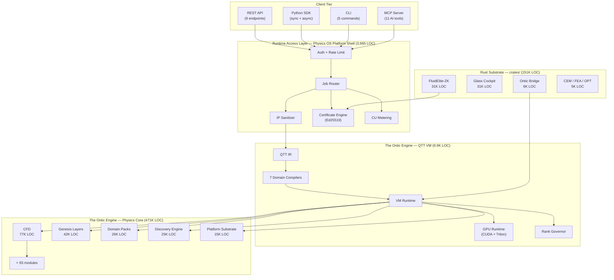
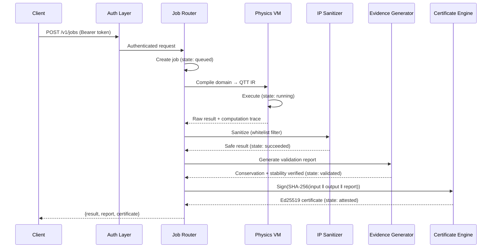
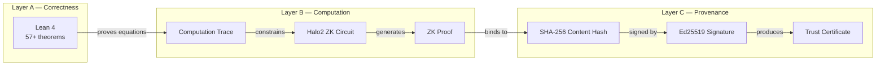

<div align="center">

# The Physics OS — Architecture

**Release v4.0.1** · **February 2026** · **Powered by The Ontic Engine**

</div>

---

## System Overview

The Physics OS is organized as a layered monorepo where each tier has a strict dependency direction: higher layers depend on lower layers, never the reverse.



---

## Key Architectural Decisions

| ADR | Decision | Rationale |
|:---:|----------|-----------|
| 001 | QTT as sole representation | O(log N) memory enables exascale on commodity hardware |
| 003 | Never-Dense guarantee | All operations remain in TT format; dense materialization is structurally blocked |
| 005 | Three-layer trust stack | Lean 4 → Halo2 ZK → Ed25519 covers correctness, computation, and provenance |
| 008 | Whitelist-only IP sanitization | Positive filter (25 forbidden categories) protects all internal state |
| 012 | Register-based VM | Domain-agnostic execution enables one runtime for 168 physics nodes |
| 015 | Python↔Rust IPC via mmap | 9ms cross-language latency without serialization overhead |
| 019 | Tag-driven OIDC release | Zero stored secrets; GitHub is the only trust anchor |

Full ADR archive: [`docs/adr/`](docs/adr/) (25 records)

---

## Data Flow — Job Lifecycle



---

## IP Boundary

The **IP Sanitizer** (`hypertensor/core/sanitizer.py`) enforces a whitelist-only boundary between the physics engine and all external surfaces. This is the single chokepoint through which every result must pass.

```
                          ┌──────────────────────────┐
    Physics Engine ──────▶│    IP SANITIZER           │──────▶ External Surface
    (full internal state)  │  25 forbidden categories  │        (safe subset only)
                          │  Whitelist-only filter     │
                          └──────────────────────────┘
```

**Forbidden categories include**: raw TT cores, bond dimensions, rank trajectories, compression ratios, internal solver parameters, convergence history, GPU kernel configs, and 17 more.

---

## Verification Architecture



---

## Detailed Architecture Guide

For module-level dependency graphs, algorithm workflows, and extension point documentation, see the comprehensive guide:

**[`docs/architecture/ARCHITECTURE_GUIDE.md`](docs/architecture/ARCHITECTURE_GUIDE.md)** — 354 lines, 8+ Mermaid diagrams

---

## Related Documents

| Document | Purpose |
|----------|---------|
| [`PLATFORM_SPECIFICATION.md`](PLATFORM_SPECIFICATION.md) | Complete platform specification (2,052 lines) |
| [`docs/adr/`](docs/adr/) | 25 Architecture Decision Records |
| [`API_SURFACE_FREEZE.md`](API_SURFACE_FREEZE.md) | Frozen API contract definition |
| [`DETERMINISM_ENVELOPE.md`](DETERMINISM_ENVELOPE.md) | Deterministic execution guarantees |
| [`docs/governance/CONSTITUTION.md`](docs/governance/CONSTITUTION.md) | Governance and decision authority |
