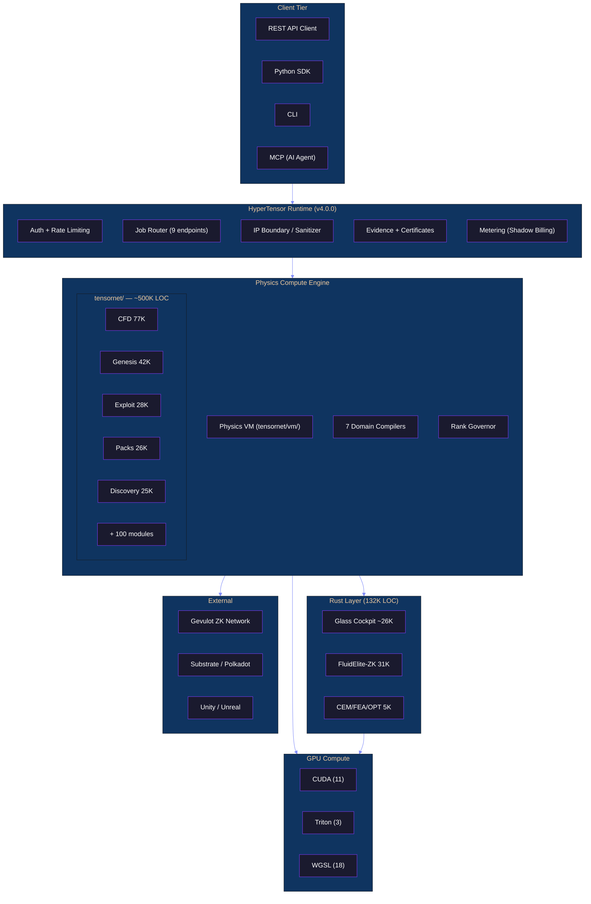

<div align="center">

```
██╗  ██╗██╗   ██╗██████╗ ███████╗██████╗ ████████╗███████╗███╗   ██╗███████╗ ██████╗ ██████╗ 
██║  ██║╚██╗ ██╔╝██╔══██╗██╔════╝██╔══██╗╚══██╔══╝██╔════╝████╗  ██║██╔════╝██╔═══██╗██╔══██╗
███████║ ╚████╔╝ ██████╔╝█████╗  ██████╔╝   ██║   █████╗  ██╔██╗ ██║███████╗██║   ██║██████╔╝
██╔══██║  ╚██╔╝  ██╔═══╝ ██╔══╝  ██╔══██╗   ██║   ██╔══╝  ██║╚██╗██║╚════██║██║   ██║██╔══██╗
██║  ██║   ██║   ██║     ███████╗██║  ██║   ██║   ███████╗██║ ╚████║███████║╚██████╔╝██║  ██║
╚═╝  ╚═╝   ╚═╝   ╚═╝     ╚══════╝╚═╝  ╚═╝   ╚═╝   ╚══════╝╚═╝  ╚═══╝╚══════╝ ╚═════╝ ╚═╝  ╚═╝
```

### The Computational Physics Operating System

*Verifiable Structured Compute Infrastructure for Physics Simulation*

[]()
[]()
[]()
[]()
[]()
[]()

[]()
[]()
[]()
[]()
[]()
[]()
[]()
[](LICENSE)

**Release v4.0.1** · **Platform V3.0.0** · **Package V40.0.1** · **February 2026** · **Scope-Frozen Baseline**

</div>

---

## §1 Executive Summary

HyperTensor is a computational physics operating system that uses Quantized Tensor Train (QTT) compression to operate on **10¹² grid points** without dense materialization — enabling simulations that previously required supercomputers to run on commodity hardware with cryptographic evidence guarantees.

| Capability | Traditional CFD | HyperTensor |
|------------|:-:|:-:|
| **Grid Resolution** | 10⁶ points | **10¹² points** |
| **Memory Scaling** | O(N³) | **O(log N)** |
| **GPU Acceleration** | Manual | **Auto-detect** |
| **Time-to-Insight** | Days | **Minutes** |
| **Formal Verification** | None | **Lean 4 proofs** |
| **ZK Proof Generation** | None | **Halo2 circuits** |
| **Trust Certificates** | None | **Ed25519 signed** |

### Key Differentiators

- **Never Go Dense.** Every operation stays in TT/QTT format. Dense materialization is structurally blocked — not merely discouraged, but architecturally prevented.
- **Physics-First Architecture.** Conservation laws are not optional. Every solver verifies mass, momentum, and energy conservation to machine precision (Δ < 10⁻¹⁵).
- **Verifiable Compute.** Three-layer evidence stack: Lean 4 formal proofs → Halo2 ZK circuits → Ed25519-signed trust certificates with claim-witness predicates.
- **168 Physics Nodes, One Runtime.** From incompressible Navier-Stokes to lattice QCD, from DFT to biomechanics — one canonical job submission pipeline with a single V&V harness.

### Release Status

**v4.0.1** (February 27, 2026) is the **hardened baseline** for the paid private alpha program. This release builds on the v4.0.0 scope freeze with comprehensive audit remediation (35 findings), production-grade developer infrastructure (11 CI workflows, observability stack, automated dependency management), and version integrity enforcement (7-checkpoint sync). The v4.0.x release is hardening on `release/v4.0.x`; no new features, domains, or surface area are added during this cycle.

---

## §2 Table of Contents

| § | Section | Status |
|:-:|---------|:------:|
| 1 | [Executive Summary](#1-executive-summary) | — |
| 2 | [Table of Contents](#2-table-of-contents) | — |
| 3 | [Repository Metrics](#3-repository-metrics) | Validated |
| 4 | [Product Architecture — Runtime Access Layer](#4-product-architecture--runtime-access-layer) | **NEW** |
| 5 | [Physics VM — QTT Execution Engine](#5-physics-vm--qtt-execution-engine) | **NEW** |
| 6 | [Platform Components](#6-platform-components) | Revised |
| 7 | [Industry Coverage — 20 Verticals](#7-industry-coverage--20-verticals) | Existing |
| 8 | [Physics Taxonomy — 168 Nodes · 20 Domain Packs](#8-physics-taxonomy--168-nodes--20-domain-packs) | Existing |
| 9 | [Genesis Layers — QTT Meta-Primitives](#9-genesis-layers--qtt-meta-primitives) | Condensed |
| 10 | [Trustless Physics Certificates — Tenet-TPhy](#10-trustless-physics-certificates--tenet-tphy) | Condensed |
| 11 | [Capability Stack — 19 Layers](#11-capability-stack--19-layers) | Condensed |
| 12 | [Rank Atlas & Exascale Profiling](#12-rank-atlas--exascale-profiling) | **NEW** |
| 13 | [Validation & Quality](#13-validation--quality) | Revised |
| 14 | [Technical Specifications](#14-technical-specifications) | Revised |
| 15 | [Architecture Diagrams](#15-architecture-diagrams) | Revised |
| 16 | [Component Catalog](#16-component-catalog) | Revised |
| 17 | [Deployment & Operations](#17-deployment--operations) | **Expanded** |
| 18 | [Integration Points](#18-integration-points) | Revised |
| 19 | [Dependencies](#19-dependencies) | Existing |
| 20 | [Contracts & Governance](#20-contracts--governance) | **NEW** |
| 21 | [Physics Inventory Reference](#21-physics-inventory-reference) | Extracted |
| 22 | [Project Structure](#22-project-structure) | Revised |
| 23 | [Changelog](#23-changelog) | Revised |
| 24 | [Appendices](#24-appendices) | Revised |

---

## §3 Repository Metrics

> *All metrics validated via `forensic_loc_sweep_v2.py` methodology (run from repo root). Excludes vendored dependencies (40,613 files / 8.6M lines), build artifacts, and data files. Last sweep: February 27, 2026 (post-Clawdbot removal). `experiments/clawdbot/` (4,223 files) was deleted on February 27, 2026.*
>
> *Note: §3 counts authored source files only (19 language extensions, excluding JSON/binary/vendored). INVENTORY.md uses a broader methodology that includes all git-tracked files. The two documents are complementary, not contradictory.*

### Language Distribution

| Language | Lines | Code Lines | Files | Share |
|----------|------:|----------:|------:|------:|
| Python | 993,624 | 802,554 | 2,302 | 50.0% |
| Markdown | 281,239 | 203,353 | 696 | 14.1% |
| HTML | 201,974 | 186,699 | 339 | 10.2% |
| Rust | 132,120 | 113,986 | 313 | 6.6% |
| Solidity | 103,772 | 91,801 | 483 | 5.2% |
| TypeScript | 94,506 | 81,628 | 597 | 4.8% |
| JavaScript | 51,196 | 43,907 | 540 | 2.6% |
| YAML | 30,195 | 25,223 | 280 | 1.5% |
| Lean 4 | 8,022 | 6,314 | 44 | 0.4% |
| CSS | 7,658 | 6,787 | 42 | 0.4% |
| + 9 more | 84,505 | 66,811 | 146 | 4.2% |
| **Grand Total** | **1,988,811** | **1,629,063** | **5,882** | **100%** |

### Summary Counts

| Metric | Value |
|--------|------:|
| **Total Authored Lines** | 1,988,811 |
| **Authored Code (non-blank)** | 1,629,063 |
| **Source Files** | 5,882 |
| **Languages Detected** | 19 |
| **Test Files** | ~195 |
| **Tests Passing** | 370+ |
| **Gauntlet Runners** | 38 |
| **Attestation JSONs** | 125+ |
| **Documentation Files** | 696+ |
| **Documentation Directories** | 27 |
| **Architecture Decision Records** | 25 |
| **Domain Packs** | 20 |
| **Taxonomy Nodes** | 168 |
| **Industry Verticals** | 20 |
| **`tensornet/` Modules** | 105 |
| **CI/CD Workflows** | 11 |
| **Makefile Targets** | 30+ |
| **CODEOWNERS Mappings** | 289 |
| **pip Extras (Feature Flags)** | 16 |

### `tensornet/` Breakdown (Top Directories by LOC)

| Directory | Lines | Code | Files |
|-----------|------:|-----:|------:|
| `tensornet/cfd/` | 80,534 | 63,540 | 119 |
| `tensornet/infra/` | 56,829 | 45,952 | 120 |
| `tensornet/genesis/` | 41,928 | 33,099 | 87 |
| `tensornet/ml/` | 40,629 | 33,243 | 83 |
| `tensornet/engine/` | 36,601 | 29,769 | 96 |
| `tensornet/aerospace/` | 35,448 | 28,915 | 64 |
| `tensornet/packs/` | 26,239 | 21,200 | 23 |
| `tensornet/quantum/` | 25,180 | 20,118 | 103 |
| `tensornet/sim/` | 18,689 | 15,256 | 31 |
| `tensornet/em/` | 17,327 | 14,403 | 24 |
| + 95 more modules | ~121,812 | — | ~468 |
| **Total `tensornet/`** | **500,216** | **402,591** | **1,218** |

---

## §4 Product Architecture — Runtime Access Layer

The HyperTensor Runtime Access Layer (v4.0.0) is the commercial product surface over the physics compute engine. It provides **licensed execution access** and **cryptographic evidence guarantees** without exposing any runtime internals, compression algorithms, or intellectual property.

### §4.1 Architecture Overview

```
┌───────────────────────────────────────────────────────────────────────────┐
│                           Client Tier                                     │
│   ┌──────────┐  ┌──────────┐  ┌──────────┐  ┌──────────────────────┐    │
│   │ REST API │  │  Python  │  │   CLI    │  │   MCP (AI Agents)   │    │
│   │  Client  │  │   SDK    │  │          │  │   11 callable tools  │    │
│   └────┬─────┘  └────┬─────┘  └────┬─────┘  └──────────┬───────────┘    │
│        └──────────────┴─────────────┴───────────────────┘                │
└────────────────────────────────┬──────────────────────────────────────────┘
                                 │ HTTPS / Bearer Auth
┌────────────────────────────────▼──────────────────────────────────────────┐
│                     HyperTensor Runtime (FastAPI)                         │
│  ┌──────────┐  ┌──────────┐  ┌──────────┐  ┌──────────┐  ┌──────────┐  │
│  │   Auth   │  │   Rate   │  │   Job    │  │  Error   │  │ Metering │  │
│  │  Bearer  │  │  Limiter │  │  Router  │  │  E001–   │  │  Shadow  │  │
│  │  Tokens  │  │  60 rpm  │  │  9 EP    │  │  E012    │  │  Billing │  │
│  └──────────┘  └──────────┘  └────┬─────┘  └──────────┘  └──────────┘  │
│                                    │                                     │
│  ┌─────────────────────────────────▼──────────────────────────────────┐  │
│  │                    IP Boundary (Sanitizer)                         │  │
│  │  Whitelist-only extraction · 25 forbidden field categories        │  │
│  │  No TT cores · No bond dims · No SVD spectra · No opcodes        │  │
│  └─────────────────────────────────┬──────────────────────────────────┘  │
│                                    │                                     │
│  ┌──────────┐  ┌──────────┐  ┌────▼─────┐  ┌──────────┐  ┌──────────┐  │
│  │ Registry │  │ Executor │  │   QTT    │  │ Evidence │  │  Certs   │  │
│  │ 7-domain │  │  Bridge  │  │   VM     │  │ Validate │  │ Ed25519  │  │
│  │ Compiler │  │  to VM   │  │ Runtime  │  │ + Claims │  │  Signed  │  │
│  └──────────┘  └──────────┘  └──────────┘  └──────────┘  └──────────┘  │
└───────────────────────────────────────────────────────────────────────────┘
```

### §4.2 Four Surfaces

| Surface | Entry Point | Purpose | Auth |
|---------|-------------|---------|:----:|
| **REST API** | `hypertensor.api.app:app` | 9-endpoint FastAPI server for job submission, results, certificates | Bearer |
| **Python SDK** | `hypertensor.sdk.client` | Sync + async typed client with polling, local validation | Bearer |
| **CLI** | `python -m hypertensor` | `run`, `validate`, `attest`, `verify`, `serve` commands | Key |
| **MCP Server** | `hypertensor.mcp.server` | 11 AI-agent-callable tools for physics simulation workflows | Config |

### §4.3 Job Model

**6 States · 6 Job Types · FIFO Queue · Idempotent Submission**

```
queued ──→ running ──→ succeeded ──→ validated ──→ attested
                    ╲
                     ──→ failed
```

| State | Terminal | Description |
|-------|:--------:|-------------|
| `queued` | No | Accepted, awaiting execution |
| `running` | No | Executing on compute backend |
| `succeeded` | No | Execution complete, result available |
| `failed` | Yes | Execution failed (error code + message) |
| `validated` | No | Result validated against contract |
| `attested` | Yes | Trust certificate generated and signed |

| Job Type | Purpose |
|----------|---------|
| `full_pipeline` | Complete: submit → execute → validate → attest |
| `physics_vm_execution` | Run physics simulation only |
| `rank_atlas_benchmark` | Full Rank Atlas benchmark suite |
| `rank_atlas_diagnostic` | Single-pack or dataset diagnostic |
| `validation` | Validate an existing result bundle |
| `attestation` | Generate trust certificate from result |

Idempotency is provided via `X-Idempotency-Key` header. Duplicate submissions with the same key return the existing job without re-execution. Queue behavior is specified in [`QUEUE_BEHAVIOR_SPEC.md`](docs/governance/QUEUE_BEHAVIOR_SPEC.md).

### §4.4 Security Architecture

**IP Boundary.** The `sanitize_result()` function in `hypertensor/core/sanitizer.py` is the **sole exit path** from the QTT runtime to the public API. It performs whitelist-only extraction — only explicitly listed fields pass through. Everything else is discarded at the function boundary. This is not a filter; it is a reconstruction step that builds a new dictionary from scratch.

**Allowed fields:** domain, grid metadata, dense field values (from `qtt.to_dense()`), conservation metrics, performance timing, validation reports, certificate metadata.

**Forbidden fields (25 categories):** Bond dimensions, compression ratios, singular values, TT cores, rank evolution, scaling classifications, IR opcodes, register state, truncation policy, internal class names, stack traces, timing internals, key material, config internals. Leaking any forbidden field is a **security incident** per [`FORBIDDEN_OUTPUTS.md`](docs/governance/FORBIDDEN_OUTPUTS.md).

**Certificate Signing.** Ed25519 asymmetric signing via the `cryptography` library. Each certificate contains claim-witness predicates (CONSERVATION, STABILITY, BOUND) with deterministic evaluation. The signing key is the most sensitive asset — compromise enables certificate forgery. Key management procedures are in [`SECURITY_OPERATIONS.md`](docs/operations/SECURITY_OPERATIONS.md).

**Authentication.** Static bearer tokens (`HYPERTENSOR_API_KEYS`), per-key token-bucket rate limiting (default 60 rpm, burst 10), timing-safe comparison.

### §4.5 Error Model

All errors use a structured envelope: `{ "code": "E001–E012", "message": "...", "retryable": bool }`.

| Code | HTTP | Meaning | Retryable |
|------|:----:|---------|:---------:|
| E001 | 400 | Invalid domain | No |
| E002 | 400 | Parameter out of range | No |
| E003 | 422 | Invalid request payload | No |
| E004 | 404 | Job not found | No |
| E005 | 409 | Job not in required state | Yes |
| E006 | 200* | Simulation diverged | No |
| E007 | 200* | Execution timeout | Yes |
| E008 | 200* | Validation failed | No |
| E009 | 400 | Invalid artifact bundle | No |
| E010 | 429 | Rate limit exceeded | Yes |
| E011 | 401 | Authentication failed | No |
| E012 | 500 | Internal error (opaque) | Yes |

*E006–E008 appear in the job's error field, not as HTTP errors. Full specification: [`ERROR_CODE_MATRIX.md`](docs/governance/ERROR_CODE_MATRIX.md).

### §4.6 Billing & Metering

**Compute Unit (CU)** = `wall_time_s × device_multiplier` (CPU: 1.0×, GPU: 10.0×). CU is derived from the sanitized result's `performance.wall_time_s`, cryptographically bound to the certificate's `result_hash` via SHA-256. Clients can independently verify metering by checking the certificate signature and recomputing CU from the certified wall time.

| Package | CU Included | Price/Month | Overage |
|---------|:-----------:|:-----------:|:-------:|
| Explorer | 100 CU | $0 | N/A |
| Builder | 1,000 CU | $49 | $0.05/CU |
| Professional | 10,000 CU | $299 | $0.03/CU |

Alpha status: shadow billing only (no real charges). Full specification: [`METERING_POLICY.md`](docs/governance/METERING_POLICY.md), [`PRICING_MODEL.md`](docs/product/PRICING_MODEL.md).

### §4.7 Determinism Guarantees

Three-tier determinism envelope per [`DETERMINISM_ENVELOPE.md`](docs/governance/DETERMINISM_ENVELOPE.md):

| Tier | Scope | Guarantee |
|:----:|-------|-----------|
| 1 | Bitwise | `canonical_json()`, `content_hash()`, signatures, state machine, sanitizer — identical bytes every call |
| 2 | Numerically Reproducible | Same platform + same seed → bitwise identical dense output; same IR, same validation |
| 3 | Physically Equivalent | Cross-platform field values within documented tolerance (CPU–CPU ≤ 1e-10, CPU–GPU ≤ 1e-6) |

### §4.8 Launch Readiness

10-gate launch checklist tracked in [`LAUNCH_GATE_MATRIX.json`](docs/operations/LAUNCH_GATE_MATRIX.json) with 55+ criteria and evidence references. Human-readable overview: [`LAUNCH_READINESS.md`](docs/product/LAUNCH_READINESS.md).

### §4.9 `hypertensor/` Package Layout (31 files, 3,965 lines)

| Package | Files | Purpose |
|---------|:-----:|---------|
| `hypertensor/api/` | 8 | FastAPI application, routers (jobs, validate, capabilities, contracts, health), auth, config |
| `hypertensor/core/` | 6 | Content-addressed hasher, 7-domain compiler registry, VM executor bridge, IP sanitizer, evidence generator, Ed25519 certificates |
| `hypertensor/jobs/` | 2 | 6-state machine, thread-safe in-memory store with idempotency |
| `hypertensor/sdk/` | 1 | Sync + async typed client |
| `hypertensor/cli/` | 3 | CLI entry point and command dispatch |
| `hypertensor/mcp/` | 1 | MCP server with 11 AI-agent tools |
| `contracts/v1/` | 2 | Runtime contract spec + JSON Schema for artifact envelopes |

---

## §5 Physics VM — QTT Execution Engine

The Physics VM (`tensornet/vm/`, 29 files, 9,896 LOC) is a register-based bytecode execution engine for Quantized Tensor Train computations. It compiles physics domain specifications into an intermediate representation (IR) of QTT operations and executes them without ever materializing full dense arrays.

### §5.1 VM Architecture

| Component | Module | Purpose |
|-----------|--------|---------|
| **IR** | `tensornet/vm/ir.py` | Instruction set defining QTT operations (create, apply operator, measure, round, step) |
| **Compilers** | `tensornet/vm/compilers/` | Domain-specific compilers that translate physics parameters into IR instruction sequences |
| **Runtime** | `tensornet/vm/runtime.py` | Register-based executor: allocates QTT registers, dispatches IR instructions, manages state |
| **GPU Runtime** | `tensornet/vm/gpu_runtime.py` | CUDA/Triton-accelerated execution path for supported operations |
| **QTT Tensor** | `tensornet/vm/qtt_tensor.py` | Core QTT data structure with TT-decomposition, orthogonalization, truncation |
| **Operators** | `tensornet/vm/operators.py` | QTT-format differential operators (shift, Laplacian, gradient, advection) |
| **GPU Operators** | `tensornet/vm/gpu_operators.py` | GPU-accelerated operator kernels |
| **Rank Governor** | `tensornet/vm/rank_governor.py` | Adaptive truncation policy controlling bond dimensions during time evolution |
| **Telemetry** | `tensornet/vm/telemetry.py` | Execution metrics: wall time, conservation tracking, invariant monitoring |
| **Benchmark** | `tensornet/vm/benchmark.py` | Rank Atlas integration for QTT performance profiling |
| **Postprocessing** | `tensornet/vm/postprocessing.py` | Dense reconstruction, field extraction, coordinate generation |

### §5.2 Domain Compilers

Each supported physics domain has a dedicated compiler that translates physical parameters into a sequence of IR instructions for the VM.

| Domain | Key | Dimensions | Governing Equation |
|--------|-----|:----------:|-------------------|
| Viscous Burgers | `burgers` | 1D | $u_t + uu_x = \nu u_{xx}$ |
| Maxwell TE Mode | `maxwell` | 1D | $\partial_t E = c\partial_x H$, $\partial_t H = c\partial_x E$ |
| Maxwell 3D | `maxwell_3d` | 3D | Full curl–curl system |
| Schrödinger | `schrodinger` | 1D | $i\hbar\psi_t = -(\hbar^2/2m)\psi_{xx} + V\psi$ |
| Advection-Diffusion | `advection_diffusion` | 1D | $u_t + cu_x = \kappa u_{xx}$ |
| Vlasov-Poisson | `vlasov_poisson` | 2D | $f_t + vf_x + (q/m)Ef_v = 0$ |
| Navier-Stokes 2D | `navier_stokes_2d` | 2D | Incompressible vorticity-streamfunction |

### §5.3 Rank Governor

The Rank Governor implements an adaptive truncation policy that controls bond dimensions during time evolution. After each rank-growing operation (operator application, addition), the governor truncates singular values below a relative tolerance threshold while respecting a maximum rank bound. This ensures memory remains O(log N) throughout the simulation while preserving physical accuracy within documented tolerances.

Key parameters: `max_rank` (2–128, default 64), relative truncation tolerance (configurable per domain), and the **never-dense guarantee** — at no point in the execution pipeline is a full N-dimensional array materialized.

### §5.4 GPU Runtime

When `HYPERTENSOR_DEVICE=cuda` (or `auto` with CUDA available), the GPU runtime dispatches QTT operations to Triton JIT-compiled or CUDA kernels. Operations that remain in compressed format (operator application, truncation, rounding) execute entirely on-device. Dense reconstruction for output fields is the only step that materializes array data, and this occurs at the sanitizer boundary after execution completes.

---

## §6 Platform Components

### §6.1 Six Integrated Platforms

| # | Platform | Location | Size | Language | Purpose |
|:-:|----------|----------|-----:|----------|---------|
| 1 | **HyperTensor Runtime** | `hypertensor/` | 3,965 LOC | Python | Commercial product surface: API, SDK, CLI, MCP, billing, certificates |
| 2 | **HyperTensor VM** | `tensornet/` | ~500K LOC | Python | Physics compute engine: 105+ modules, ~1,218 files |
| 3 | **FluidElite** | `crates/fluidelite*/` | 57K LOC | Python + Rust | Production tensor engine + ZK prover (24 binaries) |
| 4 | **QTeneT** | `apps/qtenet/` | ~13K LOC | Python + LaTeX | Enterprise QTT SDK: TCI, operators, solvers, demos, benchmarks |
| 5 | **Platform Substrate** | `tensornet/platform/` + `tensornet/sdk/` | 13.7K LOC | Python | Unified simulation API: WorkflowBuilder, domain packs, V&V harness |
| 6 | **Sovereign Compute** | `tensornet/sovereign/`, `crates/gevulot/` | 3K LOC | Python | Decentralized physics computation network |

### §6.2 Platform Substrate V2.0.0

The Platform Substrate (`tensornet/platform/`, 33 modules, 12,618 LOC) provides the canonical simulation API. All domain packs, solvers, and workflows conform to its protocols.

**Core APIs:**
- `ProblemSpec`, `Discretization`, `Solver`, `Observable`, `Workflow` — runtime-checkable Protocol classes
- `DomainSpec`, `FieldSpec`, `SolverConfig`, `SimulationResult` — typed data model with validation
- 7 PDE solvers: Poisson, advection-diffusion, Stokes, Helmholtz, wave, Euler, coupled
- QTT acceleration: TCI black-box decomposition, Kronecker PDE solver, automatic rank control

**SDK** (`tensornet/sdk/`, 3 files, 1,072 LOC):
- `WorkflowBuilder` fluent API: `.domain()` → `.mesh()` → `.physics()` → `.solve()` → `.export()`
- Pre-built recipes: `thermal_analysis`, `cfd_pipeline`, `structural_analysis`

**V&V Harness** (`tensornet/platform/vv/`, 6 files, 2,418 LOC):
- Convergence studies (h/p/dt with Richardson extrapolation)
- Conservation tracking (mass, momentum, energy)
- Method of Manufactured Solutions framework
- Stability analysis (CFL, von Neumann, eigenvalue)

### §6.3 Component Taxonomy

| Type | Definition | Usage | Example |
|------|------------|-------|---------|
| **Platform** | Integrated system with APIs and infrastructure | Deploy & configure | HyperTensor Runtime |
| **Module** | Reusable library with `__init__.py` | `import` statement | `tensornet/cfd/` |
| **Application** | Standalone executable with `main()` | `python script.py` | `hellskin_gauntlet.py` |
| **Tool** | Single-purpose utility | Invoke for specific task | `verilog_elite_analyzer.py` |

### §6.4 Version Namespaces

All version numbers are synchronized via `tools/sync_versions.py`, which validates 7 checkpoints across 5 manifest files against the single source of truth in `VERSION`.

| Namespace | Current | Source | Scope |
|-----------|:-------:|--------|-------|
| **Release** | v4.0.1 | Git tag (v4.0.0 baseline: `569ff1da`) | Infrastructure-hardened baseline |
| **Platform** | V3.0.0 | `README.md` badge | Overall HyperTensor platform version |
| **Platform Substrate API** | V2.0.0 | `tensornet/platform/__init__.py` | Platform module API version |
| **Package (tensornet)** | 40.0.1 | `tensornet.__version__` | Physics engine package version |
| **Package (hypertensor)** | 40.0.1 | `hypertensor.__version__` | Runtime Access Layer package version |
| **Runtime Version** | 1.0.0 | `hypertensor.RUNTIME_VERSION` | Execution engine compatibility version |
| **API Version** | 2.0.0 | `hypertensor.API_VERSION` | API contract schema version |
| **API Contract (URI)** | v1 | `/v1/` URI prefix | Frozen endpoint contract |
| **Cargo Workspace** | 4.0.0 | `Cargo.toml` header | Rust workspace release version |
| **CITATION** | 4.0.0 | `CITATION.cff` | Academic citation version (tracks RELEASE) |

**Version Sync Checkpoints:**

| Checkpoint | File | Field |
|:----------:|------|-------|
| 1 | `pyproject.toml` | `version` → PACKAGE (40.0.1) |
| 2 | `CITATION.cff` | `version` → RELEASE (4.0.0) |
| 3 | `tensornet/__init__.py` | `__version__` → PACKAGE (40.0.1) |
| 4 | `hypertensor/__init__.py` | `__version__` → PACKAGE (40.0.1) |
| 5 | `hypertensor/__init__.py` | `RUNTIME_VERSION` → RUNTIME (1.0.0) |
| 6 | `hypertensor/__init__.py` | `API_VERSION` → SUBSTRATE_API (2.0.0) |
| 7 | `Cargo.toml` | `# Version:` comment → RELEASE (4.0.0) |

---

## §7 Industry Coverage — 20 Verticals

The HyperTensor Civilization Stack deploys QTT-compressed physics simulation across 20 industry verticals, each with dedicated domain packs, validation gauntlets, and attestation artifacts.

| Phase | Industry | Key Physics | Representative Application |
|:-----:|----------|-------------|---------------------------|
| 1 | Aerospace & Defense | Hypersonic CFD, 6-DOF guidance | Re-entry heat shield (`hellskin`) |
| 2 | Energy — Wind | Wake modeling, turbine digital twin | FLORIS benchmark validation |
| 3 | Energy — Grid | Frequency response, SCADA | UK grid data correlation |
| 4 | Energy — Fusion | Tokamak MHD, MARRS solid-state | ITER confinement scaling |
| 5 | Finance | Order book NS physics | Coinbase L2 liquidity modeling |
| 6 | Urban Planning | Street canyon CFD, pollution | Manhattan dispersion study |
| 7 | Agriculture | Vertical farm HVAC, LED thermal | Sensor-validated climate control |
| 8 | Materials Science | Superconductor, superionic | LaLuH₆ at 300K (Odin solver) |
| 9 | Quantum Computing | Error correction, surface codes | [[d²,1,d]] MWPM decoding |
| 10 | Molecular Design | Drug binding, QM/MM, FEP | M2 ion channel blocker |
| 11 | Medical | Arterial CFD, surgical planning | Facial plastics digital twin |
| 12 | Motorsport Racing | Dirty air, slipstream drafting | Wind tunnel–CFD correlation |
| 13 | Ballistics | Long-range trajectory | G7 BC validation |
| 14 | Emergency Response | Wildfire spread | CAL FIRE data benchmark |
| 15 | Agriculture (Extended) | Vertical farm LED optimization | IR thermography validation |
| 16 | Biology / Longevity | Epigenetic aging, Yamanaka factors | QTT-Aging rank dynamics |
| 17 | Electromagnetics | Maxwell FDTD, antenna, PML | CEM-QTT Poynting conservation |
| 18 | Structural Mechanics | Hex8 FEA, linear elasticity | FEA-QTT cantilever benchmark |
| 19 | Optimization | SIMP topology, adjoint, inverse | OPT-QTT compliance minimization |
| 20 | Facial Plastic Surgery | Multi-physics surgical simulation | 102-file product (~50K LOC, 941 tests) |

---

## §8 Physics Taxonomy — 168 Nodes · 20 Domain Packs

The platform's physics coverage is organized into 20 domain packs containing 168 taxonomy nodes, spanning all implemented governing equations, numerical methods, and validation benchmarks.

| Pack | ID | Nodes | Key Domains |
|------|:--:|:-----:|-------------|
| CFD Foundations | I | 11 | Euler, NS, RANS, LES, WENO, reactive |
| Quantum Many-Body | II | 10 | DMRG, TEBD, TDVP, Yang-Mills, spin chains |
| Plasma & MHD | III | 8 | Vlasov-Poisson, MHD, two-stream, Landau |
| Fusion Energy | IV | 6 | Tokamak, MARRS, Greenwald, disruption |
| Condensed Matter | V | 12 | DFT, Hubbard, superconductor, phonon |
| Electromagnetics | VI | 7 | FDTD, PML, antenna, CEM-QTT |
| Structural Mechanics | VII | 5 | FEA, elasticity, Hex8, cantilever |
| Topology Optimization | VIII | 4 | SIMP, adjoint, inverse, OC update |
| Biological Aging | IX | 6 | Horvath clock, Yamanaka, rank dynamics |
| Neuroscience | X | 4 | Hodgkin-Huxley, neural fields |
| Astrodynamics | XI | 5 | N-body, Keplerian, perturbation |
| Atmospheric Science | XII | 6 | Weather, turbulence, pollution |
| Chemistry | XIII | 5 | Reaction kinetics, thermodynamics |
| Mathematical Physics | XIV | 8 | NS regularity, Hou-Luo, Kida vortex |
| Quantum Computing | XV | 4 | Surface codes, error correction |
| QTT Infrastructure | XVI | 8 | TCI, Morton Z-curve, operators |
| Civilization Stack | XVII | 20 | All vertical-specific physics |
| Nuclear & Particle | XVIII | 6 | PWA Eq. 5.48, Breit-Wigner |
| Relativity | XIX | 3 | Geodesics, Schwarzschild, GW |
| Multi-Physics Coupling | XX | 14 | FSI, CHT, electromagnetics-thermal |

**Maturity states**: Production (validated against benchmarks) · Research (implemented, validation pending) · Experimental (prototype).

Full domain-level audit: [`DOMAIN_PACK_AUDIT.md`](docs/governance/DOMAIN_PACK_AUDIT.md).

---

## §9 Genesis Layers — QTT Meta-Primitives

The TENSOR GENESIS Protocol extends QTT into 8 unexploited mathematical domains. All layers were implemented January–February 2026 (40,836 LOC across 80 files).

| Layer | Primitive | Module | LOC | Key Capability |
|:-----:|-----------|--------|----:|----------------|
| 20 | **QTT-OT** | `tensornet/genesis/ot/` | 4,190 | Trillion-point Sinkhorn optimal transport in O(r³ log N) |
| 21 | **QTT-SGW** | `tensornet/genesis/sgw/` | 2,822 | Billion-node spectral graph wavelets with Chebyshev filters |
| 22 | **QTT-RMT** | `tensornet/genesis/rmt/` | 2,501 | Random matrix eigenvalue statistics without dense storage |
| 23 | **QTT-TG** | `tensornet/genesis/tropical/` | 3,143 | Shortest paths via tropical min-plus semiring algebra |
| 24 | **QTT-RKHS** | `tensornet/genesis/rkhs/` | 2,904 | Trillion-sample Gaussian processes with QTT kernel matrices |
| 25 | **QTT-PH** | `tensornet/genesis/topology/` | 2,149 | Persistent homology (Betti numbers β₀, β₁, β₂) at scale |
| 26 | **QTT-GA** | `tensornet/genesis/ga/` | 3,277 | Clifford algebras Cl(p,q,r) — Cl(50) in KB, not PB |
| 27 | **QTT-Aging** | `tensornet/genesis/aging/` | 5,210 | Biological aging as rank growth; reversal as rank reduction |

**Cross-Primitive Pipeline** — Chains OT → SGW → RKHS → PH → GA end-to-end without densification:

| Stage | Primitive | Operation | Output |
|:-----:|-----------|-----------|--------|
| 1 | QTT-OT | Climate distribution transport | W₂ distance |
| 2 | QTT-SGW | Multi-scale spectral analysis | Energy per scale |
| 3 | QTT-RKHS | MMD anomaly detection | Anomaly confidence |
| 4 | QTT-PH | Topological structure | Betti numbers |
| 5 | QTT-GA | Geometric characterization | Severity metric |

**Gauntlet**: 8/8 PASS (7 meta-primitives + 1 applied layer), 301 total tests.
**Attestations**: `GENESIS_GAUNTLET_ATTESTATION.json`, `QTT_AGING_ATTESTATION.json`.

<details>
<summary><strong>Genesis Layer Details</strong></summary>

**Layer 20 (OT)**: QTTDistribution (Gaussian, uniform, arbitrary PDFs), QTTSinkhorn, wasserstein_distance (W₁/W₂/Wₚ), barycenter.

**Layer 21 (SGW)**: QTTLaplacian (O(r² log N)), QTTGraphWavelet (Mexican hat, heat kernels), energy conservation across scales.

**Layer 22 (RMT)**: QTTEnsemble (Wigner, Wishart, Marchenko-Pastur), QTTResolvent G(z) trace estimation, Wigner semicircle validation.

**Layer 23 (TG)**: TropicalSemiring (min-plus, max-plus), TropicalMatrix, floyd_warshall_tropical, tropical_eigenvalue.

**Layer 24 (RKHS)**: RBFKernel, GPRegressor, maximum_mean_discrepancy, kernel_ridge_regression with QTT kernel matrices.

**Layer 25 (PH)**: VietorisRips complex, QTTBoundaryOperator, compute_persistence, PersistenceDiagram birth-death tracking.

**Layer 26 (GA)**: CliffordAlgebra Cl(p,q,r), Multivector with QTT-compressed coefficients, geometric/inner/outer products, ConformalGA for robotics.

**Layer 27 (Aging)**: CellStateTensor (8 modes, 88 QTT sites), AgingOperator (epigenetic drift, proteostatic collapse, telomere attrition), HorvathClock, GrimAgeClock, YamanakaOperator (rank-4 projection), PartialReprogrammingOperator, SenolyticOperator, CalorieRestrictionOperator, AgingTopologyAnalyzer (persistent homology of aging trajectories), find_optimal_intervention. Core thesis: young cell rank ≤ 4 → aged cell rank ~50–200 → Yamanaka reversal to rank ~4.

</details>

Full specifications: [`TENSOR_GENESIS.md`](TENSOR_GENESIS.md).

---

## §10 Trustless Physics Certificates — Tenet-TPhy

Cryptographic proof that a physics simulation ran correctly — without revealing the simulation internals.

### Three-Layer Verification Stack

| Layer | Name | Implementation | Status |
|:-----:|------|----------------|:------:|
| A | **Mathematical Truth** | Lean 4 formal proofs of governing equations | ✅ |
| B | **Computational Integrity** | Halo2 ZK circuits for QTT computation traces | ✅ |
| C | **Physical Fidelity** | Ed25519-signed trust certificates with claim-witness predicates | ✅ |

### Phase Summary

| Phase | Scope | LOC | Gauntlet | Key Deliverables |
|:-----:|-------|----:|:--------:|-----------------|
| 0 | Foundation | 6,416 | 25/25 | TPC binary format, computation trace logger, proof bridge, certificate generator, standalone verifier |
| 1 | Single-Domain MVP | ~4,300 | 24/24 | Euler 3D ZK circuit (Halo2), Lean 4 EulerConservation (12+ theorems), end-to-end TPC pipeline |
| 2 | Multi-Domain | ~6,100 | 45/45 | NS-IMEX ZK circuit, Lean 4 NavierStokesConservation (20+ theorems), REST API, deployment package |
| 3 | Scaling | ~9,500 | 40/40 | Prover pool (batch + incremental + compressor), Gevulot decentralized prover, dashboard + analytics, multi-tenant (4 tiers), WAL-backed persistence |

### Certificate Structure (v4.0.0)

Trust certificates issued by the Runtime Access Layer use a simplified but cryptographically equivalent structure:

```json
{
  "certificate_version": "1.0.0",
  "job_id": "uuid",
  "issued_at": "ISO-8601",
  "issuer": "hypertensor-runtime",
  "claims": [
    { "tag": "CONSERVATION", "claim": "...", "witness": {...}, "satisfied": true },
    { "tag": "STABILITY",    "claim": "...", "witness": {...}, "satisfied": true },
    { "tag": "BOUND",        "claim": "...", "witness": {...}, "satisfied": true }
  ],
  "input_manifest_hash": "sha256:...",
  "result_hash": "sha256:...",
  "replay_metadata": { "runtime_version": "...", "config_hash": "...", "seed": null, "device_class": "cpu" },
  "signature": "ed25519:..."
}
```

Registered claim tags: CONSERVATION, STABILITY, BOUND. Future reserved: CONVERGENCE, REPRODUCIBILITY, ENERGY_BOUND, CFL_SATISFIED. Full registry: [`CLAIM_REGISTRY.md`](docs/governance/CLAIM_REGISTRY.md).

**Attestations**: `TRUSTLESS_PHYSICS_PHASE0_ATTESTATION.json` through `TRUSTLESS_PHYSICS_PHASE3_ATTESTATION.json`.

---

## §11 Capability Stack — 19 Layers

| Layer | Name | Purpose |
|:-----:|------|---------|
| 0 | **Field Oracle** | `substrate/field.py` — `sample()`, `slice()`, `step()`, `stats()`, `serialize()` canonical API |
| 1 | **FieldOps** | Physics operators as composable `FieldGraph` nodes |
| 2 | **HyperVisual** | Real-time QTT field rendering (Glass Cockpit, GPU shaders) |
| 3 | **Benchmarks** | Performance regression tracking, gauntlet framework |
| 4 | **HyperEnv** | Gymnasium-compatible RL environments for physics-in-the-loop training |
| 5 | **Provenance** | Attestation, cryptographic audit trail, deterministic replay |
| 6 | **Intent** | Natural language → physics specification via FDL (Field Description Language) |
| 7 | **Runtime** | Field scheduler, QoS policies, bounded-latency execution |
| 8 | **Discovery** | Autonomous Discovery Engine — systematic exploration of physics parameter spaces |
| 9 | **Exploit** | QTT-based smart contract vulnerability hunting (Koopman spectral analysis) |
| 10 | **Oracle** | Assumption extraction from black-box systems |
| 11 | **ZK Analysis** | Zero-knowledge proof infrastructure for computation integrity |
| 12 | **Fusion** | Tokamak / MARRS solid-state fusion modeling |
| 13 | **Guidance** | 6-DOF trajectory, bank-to-turn, terrain-reference navigation |
| 14 | **Coordination** | Swarm formation, consensus protocols, multi-agent physics |
| 15 | **Neural** | Neural-enhanced tensor networks (PINNs, DeepONet, FNO surrogates) |
| 16 | **Digital Twin** | Real-time state synchronization, anomaly detection, POD reduced-order models |
| 17 | **Certification** | DO-178C aerospace certification framework |
| 18 | **Sovereign** | Decentralized physics compute via Gevulot + Substrate |

---

## §12 Rank Atlas & Exascale Profiling

The Rank Atlas is a systematic QTT rank profiling dataset spanning all 20 domain packs. It characterizes how QTT bond dimensions scale with grid resolution, time steps, and physical parameters — providing the empirical foundation for the Rank Governor's adaptive truncation policy.

### Atlas Datasets

| File | Packs | Lines | Description |
|------|:-----:|------:|-------------|
| `atlas_full_20pack.json` | 20 | ~158K | Complete 20-pack rank atlas |
| `atlas_phase3_v2.json` | 20 | — | Phase 3 refined atlas |
| `atlas_phase3.json` | 20 | — | Phase 3 initial atlas |
| `atlas_pilot.json` | 5 | — | Pilot atlas (first 5 packs) |
| `rank_atlas_full.json` | 20 | — | Full consolidated rank data |
| `rank_atlas_v04.json` | 20 | — | Version 4 rank profiles |

### Exascale Sweep

The exascale sweep capability demonstrates QTT computation at unprecedented scale:

- **Maximum demonstrated resolution**: 16,384³ = **4.4 × 10¹² degrees of freedom**
- **Memory**: O(log N) — remains within single-node DRAM at all tested resolutions
- **Pareto frontier**: Characterizes rank vs. accuracy tradeoff across domain packs

Results: [`exascale_sweep_log.txt`](exascale_sweep_log.txt), [`sweep_pareto_results.json`](sweep_pareto_results.json).

Commercialization strategy for 10 high-value physics domains: [`EXASCALE_IP_EXECUTION_PLAN.md`](docs/strategy/EXASCALE_IP_EXECUTION_PLAN.md).

---

## §13 Validation & Quality

### §13.1 CFD Benchmarks

| Benchmark | Type | Validation | Status |
|-----------|------|------------|:------:|
| Sod shock tube | 1D Euler | Exact Riemann solution | ✅ |
| Shu-Osher | 1D Euler | Shock-turbulence interaction | ✅ |
| Taylor-Green vortex | 2D/3D NS | Analytical decay rate | ✅ |
| Kida vortex | 3D Euler | Enstrophy conservation | ✅ |
| Double Mach reflection | 2D Euler | Woodward-Colella reference | ✅ |
| Kelvin-Helmholtz | 2D NS | Instability growth rate | ✅ |
| Lid-driven cavity | 2D NS | Ghia et al. (1982) | ✅ |
| Couette flow | 2D NS | Analytical linear profile | ✅ |

### §13.2 PWA Eq. 5.48 Benchmarks

Partial Wave Analysis replication of Badui (2020), "Extraction of Spin Density Matrix Elements," Indiana University dissertation (165 pp). 10 experiments, all verified:

| # | Experiment | Key Result |
|:-:|-----------|------------|
| 1 | Convention reduction | 3 simplifications at machine precision (< 10⁻¹²) |
| 2 | Parameter recovery | 12-amplitude fit, yield RMSE 0.009 |
| 3 | Gram acceleration | Up to 14× speedup, agreement < 10⁻¹⁵ |
| 4 | Wave-set scan | 6 J_max values, robustness atlas |
| 5 | QTT compression of Gram matrix | Infrastructure validated |
| 6 | Angular moment validation | χ²/ndf = 0.04, all pulls < 1σ |
| 7 | Beam asymmetry sensitivity | 85× Σ RMSE improvement with polarization |
| 8 | Bootstrap uncertainty | 200 resamples, 100% convergence |
| 9 | Coupled-channel PWA | 2.0× shared-wave yield improvement |
| 10 | Mass-dependent Breit-Wigner | Δm₀ ≤ 12 MeV, ΔΓ₀ ≤ 6 MeV |

### §13.3 V&V Framework

Verification and Validation follows ASME V&V 10-2019 principles via `tensornet/platform/vv/`:

| Method | Implementation | Purpose |
|--------|---------------|---------|
| Convergence studies | `vv/convergence.py` | h/p/dt refinement with Richardson extrapolation |
| Conservation tracking | `vv/conservation.py` | Mass, momentum, energy balance verification |
| MMS | `vv/mms.py` | Method of Manufactured Solutions for code verification |
| Stability analysis | `vv/stability.py` | CFL, von Neumann, eigenvalue analysis |
| Benchmark comparison | `vv/benchmarks.py` | Reference solution comparison suite |
| Performance profiling | `vv/performance.py` | Timing, memory, scaling analysis |

### §13.4 Gauntlets (38)

38 dedicated validation gauntlets in `tools/scripts/gauntlets/` covering all major subsystems. Each gauntlet produces a cryptographically signed attestation JSON with SHA-256 commit binding. An additional 8 inline module gauntlets reside within `tensornet/genesis/`.

<details>
<summary><strong>Full Gauntlet List — 38 Standalone + 8 Inline</strong></summary>

**Standalone Gauntlets** (`tools/scripts/gauntlets/`)

| Gauntlet | Domain | Tests |
|----------|--------|:-----:|
| `ade_gauntlet.py` | Autonomous Discovery V1 | ✅ |
| `ade_gauntlet_v2.py` | Autonomous Discovery V2 | ✅ |
| `chronos_gauntlet.py` | TDVP time evolution | ✅ |
| `cornucopia_gauntlet.py` | Resource optimization | ✅ |
| `femto_fabricator_gauntlet.py` | Atomic placement (< 0.1 Å) | ✅ |
| `genesis_benchmark_suite.py` | Genesis engine benchmarks | ✅ |
| `hellskin_gauntlet.py` | Re-entry heat shield | ✅ |
| `hermes_gauntlet.py` | Routing correctness | ✅ |
| `laluh6_odin_gauntlet.py` | Superconductor at 300 K | ✅ |
| `li3incl48br12_superionic_gauntlet.py` | Superionic battery | ✅ |
| `metric_engine_gauntlet.py` | Performance metrics | ✅ |
| `oracle_gauntlet.py` | Forecast accuracy | ✅ |
| `orbital_forge_gauntlet.py` | Orbital mechanics | ✅ |
| `production_hardening_gauntlet.py` | Production hardening | ✅ |
| `prometheus_gauntlet.py` | Fire simulation | ✅ |
| `proteome_compiler_gauntlet.py` | Protein folding | ✅ |
| `qtt_native_gauntlet.py` | Native QTT operations | ✅ |
| `snhff_stochastic_gauntlet.py` | Stochastic NS | ✅ |
| `sovereign_genesis_gauntlet.py` | System bootstrap | ✅ |
| `starheart_gauntlet.py` | Fusion reactor | ✅ |
| `tig011a_attestation.py` | TIG-011a project attestation | ✅ |
| `tig011a_dielectric_gauntlet.py` | Dielectric properties | ✅ |
| `tig011a_docking_qmmm.py` | Docking + QM/MM validation | ✅ |
| `tig011a_dynamic_validation.py` | Dynamic ensemble validation | ✅ |
| `tig011a_multimechanism.py` | Multi-mechanism binding | ✅ |
| `tig011a_tox_screen.py` | Toxicity screening | ✅ |
| `tig011a_wiggle_tt.py` | Wiggle test + TT compression | ✅ |
| `tomahawk_cfd_gauntlet.py` | Missile aerodynamics | ✅ |
| `trustless_physics_gauntlet.py` | TPC Phase 0 (25 tests) | ✅ |
| `trustless_physics_phase1_gauntlet.py` | TPC Phase 1 (24 tests) | ✅ |
| `trustless_physics_phase2_gauntlet.py` | TPC Phase 2 (45 tests) | ✅ |
| `trustless_physics_phase3_gauntlet.py` | TPC Phase 3 (40 tests) | ✅ |
| `trustless_physics_phase5_gauntlet.py` | TPC Phase 5 | ✅ |
| `trustless_physics_phase6_gauntlet.py` | TPC Phase 6 | ✅ |
| `trustless_physics_phase7_gauntlet.py` | TPC Phase 7 | ✅ |
| `trustless_physics_phase8_gauntlet.py` | TPC Phase 8 | ✅ |
| `trustless_physics_phase9_gauntlet.py` | TPC Phase 9 | ✅ |
| `trustless_physics_phase10_gauntlet.py` | TPC Phase 10 | ✅ |

**Inline Module Gauntlets** (`tensornet/genesis/`)

| Gauntlet | Domain | Tests |
|----------|--------|:-----:|
| `test_aging_gauntlet.py` | Biological aging / rank dynamics | ✅ |
| `qtt_ga_gauntlet.py` | Geometric Algebra | ✅ |
| `qtt_ot_gauntlet.py` | Optimal Transport | ✅ |
| `qtt_ph_gauntlet.py` | Persistent Homology | ✅ |
| `qtt_rkhs_gauntlet.py` | RKHS / Kernel Methods | ✅ |
| `qtt_rmt_gauntlet.py` | Random Matrix Theory | ✅ |
| `qtt_sgw_gauntlet.py` | Spectral Graph Wavelets | ✅ |
| `qtt_tropical_gauntlet.py` | Tropical Geometry | ✅ |

</details>

### §13.5 v4.0.0 Product Tests

Test suites introduced for the Runtime Access Layer (all post-February 10, 2026):

| Test Suite | Focus | Key Validations |
|-----------|-------|-----------------|
| `test_certificate_integrity.py` | Ed25519 certificate lifecycle | T1–T12 scenarios per [`CERTIFICATE_TEST_MATRIX.md`](docs/product/CERTIFICATE_TEST_MATRIX.md) |
| `test_billing.py` | CU metering accuracy | CU calculation, device multiplier, failed-job exclusion |
| `test_concurrent_burst.py` | Concurrent job submission | Thread safety, state machine integrity under load |
| `test_log_security.py` | Log output sanitization | No API keys, no signing material, no forbidden fields in logs |
| `test_golden_benchmark.py` | Regression baselines | Golden output comparison across all 7 domains |
| `test_alpha_acceptance.py` | End-to-end alpha workflow | Full pipeline: submit → execute → validate → attest → verify |
| `test_hypertensor.py` | Runtime Access Layer | 35 tests: version metadata, imports, hasher, sanitizer, registry, job models, store |

### §13.6 Quality Metrics

| Metric | Value | Target | Status |
|--------|------:|-------:|:------:|
| **Test Files** | ~195 | — | ✅ |
| **Tests Passing** | 370+ | — | ✅ |
| **Gauntlet Runners** | 38 | — | ✅ |
| **Test Coverage** | ~45% | 51%+ | 🟡 |
| **Clippy Warnings (Rust)** | 0 | 0 | ✅ |
| **Bare `except:` (Python)** | 0 | 0 | ✅ |
| **TODOs in Production** | 0 | 0 | ✅ |
| **Pickle Usage** | 0 | 0 | ✅ |
| **Type Hints Coverage** | ~95% | 100% | 🟡 |
| **PEP 561 Marker** | ✅ | ✅ | ✅ |
| **Attestation JSONs** | 125+ | — | ✅ |
| **Domain Packs** | 20 | — | ✅ |
| **Taxonomy Nodes** | 168 | — | ✅ |
| **CI Workflows** | 11 | — | ✅ |
| **CODEOWNERS Rules** | 289 lines | — | ✅ |
| **Version Sync Checkpoints** | 7/7 | 7/7 | ✅ |
| **Dependency Graph** | 16 nodes, 34 edges | — | ✅ |
| **Dependabot Ecosystems** | 3 | — | ✅ |

### §13.7 Launch Gate Status

Launch readiness is tracked via [`LAUNCH_GATE_MATRIX.json`](docs/operations/LAUNCH_GATE_MATRIX.json) (10 gates, 55+ criteria). Human-readable overview: [`LAUNCH_READINESS.md`](docs/product/LAUNCH_READINESS.md).

---

## §14 Technical Specifications

### §14.1 Language Distribution (Detail)

| Language | Total Lines | Code Lines | Files | Primary Location |
|----------|----------:|----------:|------:|-----------------|
| **Python** | 993,624 | 802,554 | 2,302 | `tensornet/`, `hypertensor/`, `tests/`, `tools/scripts/` |
| **Markdown** | 281,239 | 203,353 | 696 | `docs/`, repo root, `tensornet/` |
| **HTML** | 201,974 | 186,699 | 339 | `apps/`, `experiments/` |
| **Rust** | 132,120 | 113,986 | 313 | `crates/`, `apps/glass_cockpit/` |
| **Solidity** | 103,772 | 91,801 | 483 | `contracts/`, `proofs/`, `experiments/` |
| **TypeScript** | 94,506 | 81,628 | 597 | `experiments/lux/`, `experiments/hvac_cfd/` |
| **JavaScript** | 51,196 | 43,907 | 540 | `experiments/`, `integrations/` |
| **YAML** | 30,195 | 25,223 | 280 | `apps/ledger/nodes/`, `.github/` |
| **Lean 4** | 8,022 | 6,314 | 44 | `proofs/` |
| **CSS** | 7,658 | 6,787 | 42 | `experiments/lux/`, `apps/` |
| **+ 9 more** | 84,505 | 66,811 | 146 | Shell, WGSL, CUDA, TOML, Docker, Circom, GLSL, Config |

### §14.2 Python Breakdown — `tensornet/` Modules

| Module | Files | LOC | Purpose |
|--------|------:|----:|---------|
| `cfd/` | 119 | 80,534 | Computational Fluid Dynamics (Euler, NS, RANS, LES, WENO, reactive, MHD) |
| `infra/` | 120 | 56,829 | Infrastructure (scheduling, orchestration, monitoring) |
| `genesis/` | 87 | 41,928 | QTT Meta-Primitives (8 layers: OT, SGW, RMT, TG, RKHS, PH, GA, Aging) |
| `ml/` | 83 | 40,629 | Machine Learning (surrogates, PINN, active learning) |
| `engine/` | 96 | 36,601 | Compute engine (solvers, pipelines, execution) |
| `aerospace/` | 64 | 35,448 | Aerospace (re-entry, hypersonics, orbital) |
| `packs/` | 23 | 26,239 | Domain Packs (20 verticals, 168 taxonomy nodes) |
| `quantum/` | 103 | 25,180 | Quantum computing (QEC, surface codes, DMRG) |
| `sim/` | 31 | 18,689 | Simulation harness and orchestration |
| `em/` | 24 | 17,327 | Electromagnetics (Maxwell FDTD, PML, antenna) |
| `platform/` | 40 | 15,474 | Platform Substrate V2.0.0 (protocols, solvers, V&V, export) |
| `applied/` | 47 | 14,034 | Applied physics (structural, thermal, multiscale) |
| + 93 more | ~381 | ~91,304 | Domain-specific modules (fusion, hyperenv, guidance, etc.) |
| **Total** | **1,218** | **500,216** | |

> *INVENTORY.md uses a broader file traversal (all git-tracked files) and may report slightly higher totals for `tensornet/`. The §3 sweep uses the `forensic_loc_sweep_v2.py` methodology which excludes JSON, binary, and vendored files.*

### §14.3 Rust Workspace Inventory (19 Members)

| Crate | Files | LOC | Purpose |
|-------|------:|----:|---------|
| `fluidelite-zk` | 80 | 31,325 | ZK prover engine (Halo2, Euler 3D, NS-IMEX, prover pool, Gevulot, dashboard, multi-tenant) |
| `glass_cockpit` | 68 | 30,608 | Flight instrumentation and visualization (wgpu, 18 WGSL shaders) |
| `fluidelite_circuits` | 42 | 21,342 | ZK circuit definitions (Halo2 constraint systems) |
| `fluidelite_infra` | 17 | 8,542 | FluidElite infrastructure (persistence, networking, deployment) |
| `hyper_bridge` | 16 | 5,917 | Python/Rust FFI via mmap + protobuf (132KB shared memory, 9ms latency) |
| `fluidelite_core` | 9 | 3,529 | FluidElite core tensor engine (Rust) |
| `cem-qtt` | 9 | 2,695 | Maxwell FDTD solver (Q16.16 fixed-point, MPS/MPO tensor compression) |
| `hyper_core` | 10 | 2,638 | Core tensor operations |
| `glass-cockpit` | 4 | 2,194 | Cockpit utilities |
| `tci_core_rust` | 6 | 1,871 | Tensor Cross Interpolation (Rust) |
| `proof_bridge` | 6 | 1,718 | Computation trace → ZK circuit builder |
| `tci_core` | 5 | 1,337 | TCI shared library |
| `opt-qtt` | 8 | 1,208 | SIMP topology optimization + inverse problems (Q16.16, adjoint) |
| `fea-qtt` | 7 | 1,206 | Hex8 static elasticity solver (Q16.16, CG) |
| `global_eye` | 5 | 1,167 | Global monitoring |
| `trustless_verify` | 3 | 965 | Standalone TPC certificate verifier |
| `golden_demo` | 1 | 909 | Golden-path demo application (Rust) |
| `vlasov_proof` | 1 | 355 | Vlasov equation formal proof harness (Rust) |
| `hyper_gpu_py` | 1 | 347 | GPU Python bindings |

### §14.4 Lean 4 Formal Proofs

| Proof Module | Theorems | Focus |
|-------------|:--------:|-------|
| `EulerConservation.lean` | 12+ | Mass, momentum, energy conservation; Strang splitting accuracy; QTT truncation bounds |
| `NavierStokesConservation.lean` | 20+ | KE monotone decrease, viscous dissipation, IMEX accuracy, divergence-free, multi-timestep error |
| `ProverOptimization.lean` | 25 | Batch soundness, incremental correctness, compression losslessness, Gevulot equivalence, tenant independence |
| + additional proofs | — | Yang-Mills mass gap formalization, manifold theorems |

### §14.5 GPU Compute

| Type | Count | Location | Purpose |
|------|:-----:|----------|---------|
| CUDA Kernels | 11 | `tensornet/cuda/`, `tensornet/gpu/` | TT contraction, MPO×MPS, QTT rounding, advection, diffusion, pressure |
| Triton Kernels | 3 | `fluidelite/core/` | MPO kernel, tensor-times-matrix |
| WGSL Shaders | 18 | `apps/glass_cockpit/src/shaders/` | Atmosphere, cloud, earth, flow, HUD, PBR, terrain, trajectory, vortex, wake |

### §14.6 `hypertensor/` Package Breakdown

| File | LOC | Purpose |
|------|----:|---------|
| `api/app.py` | — | FastAPI application factory, middleware, lifespan |
| `api/routers/jobs.py` | — | POST /v1/jobs, GET /v1/jobs/{id}, GET result/validation/certificate |
| `api/routers/validate.py` | — | POST /v1/validate (stateless envelope validation) |
| `api/routers/capabilities.py` | — | GET /v1/capabilities (domain + job type listing) |
| `api/routers/contracts.py` | — | GET /v1/contracts/{version} (schema download) |
| `api/routers/health.py` | — | GET /v1/health (liveness check) |
| `api/auth.py` | — | Bearer token validation, rate limiter |
| `api/config.py` | — | Server configuration from environment variables |
| `core/hasher.py` | — | SHA-256 content-addressed hashing over canonical JSON |
| `core/registry.py` | — | 7-domain compiler registry (maps domain keys to VM compilers) |
| `core/executor.py` | — | Bridge: translates job parameters into VM execution calls |
| `core/sanitizer.py` | — | IP-safe output filtering (whitelist-only extraction) |
| `core/evidence.py` | — | Validation reports + claim-witness predicate generation |
| `core/certificates.py` | — | Ed25519 signing + verification (HMAC fallback) |
| `jobs/models.py` | — | Job state machine (6 states, valid transitions, InvalidTransition) |
| `jobs/store.py` | — | Thread-safe in-memory store with idempotency key lookup |
| `sdk/client.py` | — | Sync + async typed client with auth, polling, local validation |
| `cli/main.py` | — | CLI command dispatch (run, validate, attest, verify, serve) |
| `mcp/server.py` | — | MCP server with 11 AI-agent-callable tools |

---

## §15 Architecture Diagrams

### §15.1 Full System Architecture

<details>
<summary><strong>📊 Mermaid Diagram (Interactive)</strong></summary>



</details>

### §15.2 ASCII Architecture (Terminal Compatible)

```
┌─────────────────────────────────────────────────────────────────────────────────┐
│                           HyperTensor Platform V3.0.0                           │
├─────────────────────────────────────────────────────────────────────────────────┤
│                                                                                 │
│  Client Tier                                                                    │
│  ┌──────────┐  ┌──────────┐  ┌──────────┐  ┌───────────────────────────────┐  │
│  │ REST API │  │  Python  │  │   CLI    │  │  MCP Server (11 AI tools)    │  │
│  └─────┬────┘  └─────┬────┘  └─────┬────┘  └──────────────┬────────────────┘  │
│        └──────────────┴─────────────┴──────────────────────┘                   │
│                                     │  HTTPS / Bearer Auth                      │
│  ┌──────────────────────────────────▼───────────────────────────────────────┐  │
│  │         HyperTensor Runtime Access Layer (v4.0.0, 31 files)              │  │
│  │  Auth │ Rate Limit │ Job Router │ Sanitizer │ Evidence │ Certificates    │  │
│  │  Metering (shadow billing) │ Error codes E001–E012 │ Idempotency       │  │
│  └──────────────────────────────────┬───────────────────────────────────────┘  │
│                                     │  IP Boundary                              │
│  ┌──────────────────────────────────▼───────────────────────────────────────┐  │
│  │         Physics VM — QTT Execution Engine (29 files, 9.9K LOC)           │  │
│  │  IR │ Compilers (7 domains) │ Runtime │ GPU Runtime │ Rank Governor      │  │
│  └──────────────────────────────────┬───────────────────────────────────────┘  │
│                                     │                                           │
│  ┌──────────────────────────────────▼───────────────────────────────────────┐  │
│  │         tensornet/ Physics Engine (~1,218 files, ~500K LOC)              │  │
│  │  ┌────────┐ ┌────────┐ ┌────────┐ ┌────────┐ ┌────────┐ ┌────────┐     │  │
│  │  │ CFD    │ │Genesis │ │Exploit │ │ Packs  │ │Discover│ │Platform│     │  │
│  │  │ 77K    │ │ 42K    │ │ 28K    │ │ 26K    │ │ 25K    │ │ 15K    │     │  │
│  │  └────────┘ └────────┘ └────────┘ └────────┘ └────────┘ └────────┘     │  │
│  │  + 99 more domain-specific submodules                                    │  │
│  └──────────────────────────────────────────────────────────────────────────┘  │
│                                                                                 │
│  Rust Layer (313 files, 132K LOC)                                               │
│  ┌──────────────┐ ┌──────────────┐ ┌──────────────┐ ┌──────────────┐          │
│  │FluidElite-ZK │ │Glass Cockpit │ │ Hyper Bridge │ │CEM/FEA/OPT  │          │
│  │  31K LOC     │ │  31K LOC     │ │   6K LOC     │ │  5K LOC      │          │
│  └──────────────┘ └──────────────┘ └──────────────┘ └──────────────┘          │
│                                                                                 │
│  GPU Compute: CUDA Kernels (11) · Triton Kernels (3) · WGSL Shaders (18)      │
│                                                                                 │
└─────────────────────────────────────────────────────────────────────────────────┘
```

### §15.3 Job Lifecycle Sequence

```
Client                    API                     Runtime                    VM
  │                        │                        │                        │
  │  POST /v1/jobs         │                        │                        │
  │───────────────────────>│                        │                        │
  │                        │  validate + create job │                        │
  │                        │───────────────────────>│                        │
  │                        │                        │  compile → IR          │
  │                        │                        │───────────────────────>│
  │                        │                        │                        │
  │                        │                        │  execute (QTT ops)     │
  │                        │                        │<───────────────────────│
  │                        │                        │                        │
  │                        │  sanitize_result()     │                        │
  │                        │<───────────────────────│                        │
  │                        │                        │                        │
  │                        │  validate + attest     │                        │
  │                        │───────────────────────>│                        │
  │                        │                        │  Ed25519 sign          │
  │                        │<───────────────────────│                        │
  │                        │                        │                        │
  │  201 Created + status  │                        │                        │
  │<───────────────────────│                        │                        │
```

### §15.4 Design Principles

| Principle | Implementation |
|-----------|----------------|
| **Never Go Dense** | All operations in TT/QTT format; dense materialization structurally blocked |
| **Rank Control** | Automatic truncation after rank-growing operations via Rank Governor |
| **GPU First** | Auto-detect CUDA, graceful CPU fallback, Triton JIT for hot paths |
| **Reproducibility** | Deterministic seeds, three-tier determinism envelope |
| **Attestation** | Every gauntlet and every job produces cryptographically signed artifacts |
| **Physics First** | Conservation laws verified to machine precision; Lean 4 formal proofs of governing equations |
| **IP Boundary** | Zero internal state leaks — whitelist-only sanitization at every exit path |
| **Contract First** | API surface frozen, JSON Schema for all envelopes, versioned contracts |

---

## §16 Component Catalog

### §16.1 Platforms (6)

| # | Platform | Location | Size | Language |
|:-:|----------|----------|:----:|----------|
| 1 | HyperTensor Runtime | `hypertensor/` | 3,965 LOC | Python |
| 2 | HyperTensor VM | `tensornet/` | ~500K LOC | Python |
| 3 | FluidElite + ZK | `crates/fluidelite*/` | 57K LOC | Python + Rust |
| 4 | QTeneT Enterprise SDK | `apps/qtenet/` | ~13K LOC | Python + LaTeX |
| 5 | Platform Substrate + SDK | `tensornet/platform/`, `tensornet/sdk/` | 13.7K LOC | Python |
| 6 | Sovereign Compute | `tensornet/sovereign/`, `crates/gevulot/` | 3K LOC | Python |

### §16.2 Python Modules (105+ in `tensornet/`)

See [§14.2](#142-python-breakdown--tensornet-modules) for the full breakdown.

### §16.3 Rust Workspace (19 Members)

See [§14.3](#143-rust-workspace-inventory-19-members) for the full inventory.

### §16.4 Applications

| Category | Count | Examples |
|----------|:-----:|---------|
| Gauntlets | 38 | `hellskin_gauntlet.py`, `trustless_physics_phase3_gauntlet.py` |
| Proof Pipelines | 5 | `navier_stokes_millennium_pipeline.py`, `yang_mills_proof_pipeline.py` |
| Specialized Solvers | 4 | `hellskin_thermal_solver.py`, `odin_superconductor_solver.py` |
| Research Experiments | 10+ | `run_convergence_study.py`, `run_exascale_invention_sweep.py` |
| Product Verticals | 1 | `products/facial_plastics/` (102 files, ~50K LOC, 941 tests) |

### §16.5 Tools (15)

| Category | Tools |
|----------|-------|
| Hardware Security | `verilog_elite_analyzer.py`, `yosys_netlist_analyzer_v2.py`, `yosys_netlist_analyzer.py` |
| Bounty Hunting | `hunt_renzo.py`, `temp_debridge_hunt.py`, `advanced_vulnerability_hunt.py`, `GMX_V2_VULNERABILITY_ANALYSIS.py`, `cairo_circuit_hunter.py` |
| Infrastructure | LOC audit scripts, update scripts, benchmark runners |

---

## §17 Deployment & Operations

### §17.1 Hardware Targets

| Target | Configuration | Primary Use |
|--------|--------------|-------------|
| **Workstation** | 64 GB+ RAM, NVIDIA RTX 4090/A6000 | Development, single-domain simulations |
| **HPC Node** | 512 GB+ RAM, 4×A100 (80 GB) | Multi-domain, exascale sweeps |
| **Cloud GPU** | AWS p4d.24xlarge / GCP a2-ultragpu-8g | API server, on-demand physics |
| **Edge** | NVIDIA Jetson Orin NX | Embedded physics (robotics, avionics) |
| **CPU-Only** | 32 GB+ RAM, no GPU | Fallback, CI runners |

The Rank Governor automatically adapts QTT bond dimensions to fit available hardware. GPU detection is automatic; CPU fallback is production-grade.

### §17.2 Container & Packaging

| Artifact | Technology | Description |
|----------|-----------|-------------|
| `Containerfile` | Podman / Docker | Multi-stage: CUDA 12.x base → Python 3.12 → tensornet + hypertensor |
| `pyproject.toml` | PEP 517 / setuptools | Package build configuration |
| `Cargo.toml` | Cargo workspace | 19 Rust workspace members, workspace-level dependency management |
| `requirements-lock.txt` | pip | Pinned production dependencies |
| `requirements-dev.txt` | pip | Development / test dependencies |

### §17.3 Server Deployment

Deployment topology per [`OPERATIONS_RUNBOOK.md`](docs/operations/OPERATIONS_RUNBOOK.md):

```
[Load Balancer / Reverse Proxy]
         │
    ┌────┴────┐
    ▼         ▼
[HyperTensor  [HyperTensor
 API  Node 1]  API  Node N]   ← Stateless; GPU-attached
    │              │
    └──────┬───────┘
           ▼
   [Shared Artifact Store]     ← Signed certificates, results
```

**Startup sequence**: `uvicorn hypertensor.api.app:create_app --factory --host 0.0.0.0 --port 8000`

### §17.4 Logging & Monitoring

| Component | Configuration | Reference |
|-----------|--------------|-----------|
| **Structured Logging** | JSON format, configurable level | `hypertensor/api/config.py` |
| **Security Filtering** | No API keys, no signing material in logs (enforced by `test_log_security.py`) | [`SECURITY_OPERATIONS.md`](docs/operations/SECURITY_OPERATIONS.md) |
| **Health Endpoint** | `GET /v1/health` — liveness check | API |
| **Metering Telemetry** | Per-job CU capture (device, duration, error) | Per [`METERING_POLICY.md`](docs/governance/METERING_POLICY.md) |
| **Certificate Telemetry** | Ed25519 sign/verify ops logged with job ID correlation | Core |

### §17.5 CI/CD Pipeline

#### 11 GitHub Actions Workflows

| Workflow | Trigger | Function |
|----------|---------|----------|
| `ci.yml` | Push/PR to main, develop, master | Full quality gate: hygiene → lint (ruff) → typecheck (mypy) → test (pytest) → Rust (clippy + test + fmt) |
| `nightly.yml` | Cron (nightly) + manual | Nightly Rust benchmarks, performance regression tracking |
| `release.yml` | Tag push `v*` + manual | 4-stage release: validate → build (Python + Rust + container) → publish (PyPI + GHCR) → GitHub Release |
| `docs.yml` | Push to main (docs/**) | Build & deploy MkDocs Material site to GitHub Pages |
| `audit-gates.yml` | Push/PR | Audit gate enforcement (version sync, forbidden outputs, security) |
| `contracts-ci.yml` | Push/PR (contracts/**) | Contract schema validation (JSON Schema + OpenAPI) |
| `exploit-engine.yml` | Push/PR (tensornet/exploit/**) | Smart contract exploit engine validation |
| `facial-plastics-ci.yml` | Push/PR (products/**) | Facial plastics product test suite (941 tests) |
| `hardening.yml` | Push/PR | Production hardening gates (log security, certificate integrity) |
| `ledger-validation.yml` | Push/PR (apps/ledger/**) | Capability ledger schema/integrity validation (168 nodes) |
| `vv-validation.yml` | Push/PR (tensornet/platform/vv/**) | V&V framework conformance checks |

#### Makefile Orchestration (30+ Targets)

The monorepo `Makefile` orchestrates both Python and Rust toolchains with automatic `uv` detection:

```bash
# ── Quality Gates ──────────────────────────────────────────────────
make check          # All quality gates (Python + Rust)
make py-check       # Python-only: format + typecheck + test
make rs-check       # Rust-only: fmt + clippy + test
make format         # ruff format + cargo fmt (both toolchains)
make typecheck      # mypy --strict on PY_SRC

# ── Testing ────────────────────────────────────────────────────────
make test-unit      # Python unit tests
make test-int       # Integration tests
make test-physics   # Physics validation tests
make test-cov       # Coverage report (HTML + terminal)
make fp-test        # Facial Plastics product tests (941)

# ── Rust Workspace ─────────────────────────────────────────────────
make rs-build       # cargo build --workspace --release
make rs-test        # cargo test --workspace
make rs-clippy      # cargo clippy --workspace --all-targets
make rs-fmt         # cargo fmt --all -- --check

# ── Validation ─────────────────────────────────────────────────────
make physics        # Physics validation gates
make determinism    # Determinism checks
make reproduce      # Paper result reproduction
make proofs         # Lean 4 formal proofs
make evidence       # Build evidence pack (attestations)
make truth          # Truth boundary document

# ── Infrastructure ─────────────────────────────────────────────────
make docs           # Build MkDocs Material site
make docs-serve     # Live-reload dev server (localhost:8000)
make dep-graph      # Generate dependency graph (SVG + Mermaid)
make version-check  # Validate version sync (7 checkpoints)
make security       # Security scan (bandit + safety)
make sbom           # Generate SBOM
make package        # Build Python + Rust packages
make container      # podman build -f Containerfile
```

Dependencies are installed via `uv` (preferred) or `pip` — the Makefile auto-detects which is available:

```makefile
UV := $(shell command -v uv 2>/dev/null)
ifdef UV
  PIP_INSTALL = uv pip install
else
  PIP_INSTALL = $(PYTHON) -m pip install
endif
```

#### Release Automation

Tag-driven release via `.github/workflows/release.yml`:

```
v4.0.1 tag push
    │
    ▼
┌─────────────┐    ┌─────────────┐    ┌─────────────┐    ┌─────────────┐
│  1. Validate │───▶│  2. Build    │───▶│  3. Publish  │───▶│  4. Release  │
│  Version sync│    │  Python sdist│    │  PyPI (OIDC) │    │  GitHub      │
│  Quality gate│    │  Rust binaries│   │  GHCR image  │    │  Changelog   │
│  Lint + test │    │  Container   │    │  Trusted pub │    │  Attestation │
└─────────────┘    └─────────────┘    └─────────────┘    └─────────────┘
```

Supports `workflow_dispatch` with `dry_run: true` for validation without publishing. OIDC trusted publishing — no long-lived secrets for PyPI.

### §17.6 Security Operations

Per [`SECURITY_OPERATIONS.md`](docs/operations/SECURITY_OPERATIONS.md):

| Control | Implementation |
|---------|----------------|
| **Authentication** | Bearer token (HMAC-SHA256), API key rotation policy |
| **Signing** | Ed25519 keypair — server-side only, never exposed |
| **Rate Limiting** | Configurable per-client burst + sustained limits |
| **Input Validation** | Pydantic V2 strict mode; all job parameters validated before execution |
| **Output Sanitization** | Whitelist-only field extraction; see [`FORBIDDEN_OUTPUTS.md`](docs/governance/FORBIDDEN_OUTPUTS.md) |
| **Incident Response** | 4-level severity classification, escalation matrix, post-mortem template |
| **Key Management** | Env-injected, never committed, rotatable without downtime |

### §17.7 Observability & Telemetry

Production-grade monitoring via Prometheus + Grafana, deployed as a Docker Compose stack under `deploy/telemetry/`.

#### Stack Architecture

```
┌─────────────────────────────┐
│  HyperTensor API Server     │
│  :8000/metrics (Prometheus) │
└──────────┬──────────────────┘
           │ scrape (15s)
┌──────────▼──────────────────┐     ┌─────────────────────────┐
│  Prometheus  :9090           │────▶│  Grafana  :3000          │
│  30-day retention            │     │  Auto-provisioned        │
│  Alert rules (3 groups)      │     │  Overview dashboard      │
└──────────────────────────────┘     └─────────────────────────┘
```

**Launch**: `docker compose -f deploy/telemetry/docker-compose.yml up -d`

#### Alert Rules (3 Groups)

| Group | Alert | Condition | Severity |
|-------|-------|-----------|:--------:|
| **API** | `APIHighLatency` | p95 > 2s for 5m | warning |
| **API** | `APIHighErrorRate` | 5xx rate > 5% for 5m | critical |
| **API** | `APIDown` | `up == 0` for 1m | critical |
| **Jobs** | `JobQueueBacklog` | queued > 100 for 10m | warning |
| **Jobs** | `JobFailureRate` | failure rate > 10% for 5m | critical |
| **Jobs** | `LongRunningJob` | execution > 30m | warning |
| **System** | `HighMemoryUsage` | RSS > 90% for 5m | warning |
| **System** | `DiskSpaceLow` | available < 10% | critical |

#### Grafana Dashboard

Pre-provisioned `overview.json` dashboard with panels for:
- API request rate and p95 latency (time series)
- HTTP status code distribution (pie chart)
- Active/completed/failed job counts (stat panels)
- CU consumption over time (time series)
- Memory and CPU utilization (gauges)
- Certificate signing operations (counter)

Datasource auto-provisioned via `grafana/provisioning/datasources/prometheus.yml`.

### §17.8 Developer Tooling

#### Version Sync (`tools/sync_versions.py`)

Single-command validation that all version numbers are consistent:

```bash
$ python tools/sync_versions.py
Reading VERSION...
  API_CONTRACT=1  PACKAGE=40.0.1  PLATFORM=3.0.0
  RELEASE=4.0.0   RUNTIME=1.0.0   SUBSTRATE_API=2.0.0

Checking manifests:
  OK: pyproject.toml version=40.0.1
  OK: CITATION.cff version=4.0.0
  OK: __init__.py __version__=40.0.1
  OK: __init__.py __version__=40.0.1
  OK: __init__.py RUNTIME_VERSION=1.0.0
  OK: __init__.py API_VERSION=2.0.0
  OK: Cargo.toml Version=4.0.0

All versions in sync.
```

The `VERSION` file at the repository root is the single source of truth. `tools/sync_versions.py` checks 7 manifests against it — integrated into `make version-check` and the CI pipeline.

#### Dependency Graph (`tools/dep_graph.py`)

Visualizes inter-module dependencies across `tensornet/` subpackages:

```bash
$ python tools/dep_graph.py --group-only
Graph: 16 nodes, 34 edges
```

Outputs Mermaid flowcharts, DOT graphs, or SVG images. The 16 module groups and 34 edges map the full internal dependency topology, enabling impact analysis for any proposed change.

| Output Format | Command | Use Case |
|---------------|---------|----------|
| Mermaid | `--group-only` (default) | Paste into Markdown, rendered by GitHub |
| DOT | `--format dot` | Graphviz processing |
| SVG | `--format svg` | Documentation embedding |
| Module-level | (no `--group-only`) | Fine-grained file-level graph |

#### PEP 561 Type Marker

`tensornet/py.typed` enables downstream consumers to use `tensornet` type stubs with mypy, pyright, and other type checkers without `--ignore-missing-imports`.

#### Pre-Commit Hooks

`.pre-commit-config.yaml` enforces quality gates locally before push:
- `ruff check` + `ruff format` — lint and formatting
- Bare `except:` / `pickle` / `TODO` detection
- Large file prevention
- YAML / TOML / JSON syntax validation

### §17.9 Documentation System

#### MkDocs Material

Full documentation site built from `docs/` with MkDocs Material theme:

| Feature | Configuration |
|---------|--------------|
| **Theme** | Material for MkDocs (deep purple + amber accent) |
| **Dark Mode** | Media query auto-detect with manual toggle |
| **Navigation** | Tabs (sticky), sections, indexes, path breadcrumbs, footer |
| **Search** | Suggest, highlight, share |
| **Code** | Copy button, annotations, linked tabs |
| **API Docs** | mkdocstrings[python] — auto-generated from docstrings |
| **Build** | `mkdocs build --strict` (zero warnings) |
| **Deploy** | `.github/workflows/docs.yml` → GitHub Pages |
| **Dev Server** | `make docs-serve` → `localhost:8000` with live reload |

#### Documentation Structure (27 Subdirectories)

| Directory | Content |
|-----------|---------|
| `docs/adr/` | 25 Architecture Decision Records |
| `docs/api/` | API reference documentation |
| `docs/architecture/` | System architecture specifications |
| `docs/attestations/` | Attestation documentation |
| `docs/audit/` | Audit reports and execution trackers |
| `docs/commercial/` | Commercial execution plans |
| `docs/domains/` | Domain-specific physics documentation |
| `docs/getting-started/` | Quickstart guides |
| `docs/governance/` | Governing documents (constitution, policies, contracts) |
| `docs/operations/` | Runbooks, launch gates, security ops |
| `docs/papers/` | Research papers and figures |
| `docs/product/` | Product docs (pricing, release notes, launch readiness) |
| `docs/reports/` | Coverage dashboards, audit reports |
| `docs/research/` | Research notes and experiments |
| `docs/roadmaps/` | Roadmap documentation |
| `docs/specifications/` | Technical specifications |
| `docs/strategy/` | Commercial strategy, IP execution plans |
| `docs/tutorials/` | Step-by-step tutorials |
| `docs/workflows/` | Workflow documentation |
| + 8 more | Legacy, regulatory, media, phases, evolution, images, audits |

### §17.10 Dependency & Supply Chain Management

#### Dependabot (`.github/dependabot.yml`)

Automated dependency updates across 3 ecosystems:

| Ecosystem | Schedule | Directory | Grouping |
|-----------|:--------:|-----------|----------|
| **pip** | Weekly (Monday) | `/` | `python-deps` (all minor/patch) |
| **cargo** | Weekly (Monday) | `/` | `rust-deps` (all minor/patch) |
| **github-actions** | Weekly (Monday) | `/` | `actions` (all minor/patch) |

Grouped updates reduce PR noise — a single PR per ecosystem per week for non-breaking changes.

#### CODEOWNERS (289 Lines)

Domain-ownership enforcement via `.github/CODEOWNERS`:

| Path Pattern | Owner | Domain |
|-------------|-------|--------|
| `tensornet/cfd/**` | `@tigantic/cfd-team` | Computational Fluid Dynamics |
| `tensornet/genesis/**` | `@tigantic/genesis-team` | QTT Meta-Primitives |
| `tensornet/vm/**` | `@tigantic/vm-team` | Physics VM |
| `hypertensor/**` | `@tigantic/runtime-team` | Runtime Access Layer |
| `crates/**` | `@tigantic/rust-team` | Rust Substrate |
| `proofs/**` | `@tigantic/proofs-team` | Formal Verification |
| `contracts/**` | `@tigantic/contracts-team` | API Contracts |
| `products/facial_plastics/**` | `@tigantic/fp-team` | Facial Plastics Product |
| `deploy/**` | `@tigantic/infra-team` | Infrastructure |
| `.github/**` | `@tigantic/infra-team` | CI/CD |
| + 120 more | Various | Domain-specific |

Every PR requires review from the owning team. 289 path-to-owner mappings ensure no change lands without domain-expert review.

#### Feature Flags (pip Extras)

16 optional dependency groups in `pyproject.toml` enable domain-specific installation:

```bash
pip install tensornet[cfd]              # CFD dependencies only
pip install tensornet[quantum,plasma]   # Quantum + Plasma
pip install tensornet[physics-all]      # All physics domains
pip install tensornet[dev,docs]         # Development + documentation tooling
pip install tensornet[all]              # Everything
```

| Extra | Dependencies | Use Case |
|-------|:------------:|----------|
| `cfd` | scipy, h5py, matplotlib | CFD solvers |
| `quantum` | scipy | Quantum many-body |
| `fluids` | scipy, h5py | Fluid dynamics |
| `materials` | scipy | Condensed matter |
| `aerospace` | scipy, h5py | Aerospace & guidance |
| `astro` | scipy | Astrodynamics |
| `plasma` | scipy | Plasma physics |
| `ml` | scipy | Machine learning surrogates |
| `em` | scipy | Electromagnetics |
| `physics-all` | All physics extras | All physics domains combined |
| `dev` | ruff, mypy, pytest, coverage | Development tooling |
| `docs` | mkdocs-material, mkdocstrings | Documentation build |
| `viz` | matplotlib, plotly | Visualization |
| `io` | h5py, netCDF4, vtk | File I/O formats |
| `benchmark` | perf tools | Performance benchmarking |
| `all` | Everything | Full installation |

#### Git LFS & Large File Management

`.gitattributes` configures Git LFS tracking for binary assets:

| Pattern | Type | Example |
|---------|------|---------|
| `*.bin` | Binary data | `fluidelite_hybrid.bin` |
| `*.img` | Disk images | Container layers |
| `*.tar` / `*.tar.gz` | Archives | Release bundles |
| `*.whl` | Python wheels | Built packages |
| `*.obj` | 3D models | Mesh data |
| Specific large files | Named | `atlas_full_20pack.json`, `sweep_pareto_results.json` |

---

## §18 Integration Points

### §18.1 External Integrations

| Integration | Protocol | Location | Maturity |
|-------------|----------|----------|:--------:|
| **Unity** (C# SDK) | WebSocket / REST | `integrations/unity/` | Alpha |
| **Unreal Engine** (C++ Plugin) | REST | `integrations/unreal/` | Alpha |
| **Blender** | Python add-on | — | Planned |
| **FreeCAD** | Python add-on | — | Planned |
| **VS Code** | Extension | — | Planned |
| **Blockchain** | Substrate / Polkadot | `tensornet/sovereign/` | Beta |
| **ZK Network** | Gevulot protocol | `crates/gevulot/`, `crates/fluidelite_zk/` | Beta |
| **MCP** | Model Context Protocol | `hypertensor/mcp/server.py` (11 tools) | v1.0.0 |
| **REST API** | OpenAPI 3.1 | `hypertensor/api/` (9 endpoints) | v1.0.0 |

### §18.2 Cross-Language Bridges

| Bridge | Mechanism | Latency | Throughput |
|--------|-----------|--------:|-----------|
| Python ↔ Rust (`hyper_bridge`) | mmap + protobuf, 132KB shared memory | 9 ms | Streaming for tensors > 100MB |
| Python ↔ CUDA | CuPy / direct ctypes | < 1 ms | GPU memory bandwidth bound |
| Python ↔ Triton | JIT compilation | First call: ~2s; subsequent: < 1 ms | Kernel-dependent |
| Rust ↔ GPU (WGSL) | wgpu | < 1 ms | GPU bound |

### §18.3 Data Exchange Formats

| Format | Use |
|--------|-----|
| **JSON** | API request/response, attestation envelopes, certificates |
| **Protocol Buffers** | Cross-language tensor exchange (hyper_bridge) |
| **NPZ** | NumPy array serialization (internal tensors) |
| **VTK/VTU** | CFD visualization export (`tensornet/platform/export/`) |
| **ONNX** | Neural network import/export |
| **Parquet** | Tabular results (discovery, optimization) |

---

## §19 Dependencies

### §19.1 Core Python Dependencies

| Package | Version | Purpose |
|---------|---------|---------|
| `numpy` | ≥1.26 | Fundamental array operations |
| `scipy` | ≥1.12 | Sparse linear algebra, optimization |
| `fastapi` | ≥0.111 | HTTP API framework |
| `uvicorn` | ≥0.30 | ASGI server |
| `pydantic` | ≥2.7 | Request/response validation |
| `cupy` | ≥13.0 (optional) | GPU array operations |
| `matplotlib` | ≥3.8 | Visualization |
| `cryptography` | ≥42.0 | Ed25519 signing |
| `httpx` | ≥0.27 | Async HTTP client (SDK) |
| `rich` | ≥13.7 | CLI output formatting |

### §19.2 Rust Dependencies

| Crate | Purpose |
|-------|---------|
| `halo2_proofs` | ZK circuit construction and proving |
| `wgpu` | Cross-platform GPU compute (Glass Cockpit) |
| `prost` | Protocol Buffer serialization |
| `rayon` | Data parallelism |
| `tokio` | Async runtime |
| `ed25519-dalek` | Signature verification in `trustless_verify` |
| `serde` / `serde_json` | Serialization |

### §19.3 Development Dependencies

| Tool | Version | Purpose |
|------|---------|---------|
| `ruff` | ≥0.4 | Python linter (replaces flake8, isort, Black) |
| `mypy` | ≥1.10 | Static type checking (strict mode) |
| `pytest` | ≥8.2 | Test runner |
| `cargo clippy` | latest | Rust linter |
| `cargo fmt` | latest | Rust formatter |

---

## §20 Contracts & Governance

### §20.1 API Surface Contract

The API surface is **frozen** as of v4.0.0 per [`API_SURFACE_FREEZE.md`](docs/governance/API_SURFACE_FREEZE.md):

- **Frozen endpoints**: 9 (all in `hypertensor/api/routers/`)
- **Frozen schemas**: `JobRequest`, `JobResponse`, `ArtifactEnvelope`, `TrustCertificate`, `ValidationReport`, `Capabilities`, `ContractSchema`
- **Frozen error codes**: E001–E012 (see [§4.5](#45-error-model))
- **Versioning policy**: URI-versioned (`/v1/`), additive-only changes within a major version
- **Breaking change**: Requires new URI version (`/v2/`), 90-day deprecation notice

Machine-readable contract: `GET /v1/contracts/v1` → JSON Schema download.

### §20.2 Determinism Contract

Three-tier determinism per [`DETERMINISM_ENVELOPE.md`](docs/governance/DETERMINISM_ENVELOPE.md):

| Tier | Guarantee | Example |
|------|----------|---------|
| **Bitwise** | Identical bytes across runs | Hashing, serialization, signing |
| **Reproducible** | Identical within ε ≤ 10⁻¹² | Single-precision physics on same hardware |
| **Physically Equivalent** | Within measurement uncertainty | Cross-hardware, mixed precision |

### §20.3 Metering & Pricing Contract

Per [`METERING_POLICY.md`](docs/governance/METERING_POLICY.md) and [`PRICING_MODEL.md`](docs/product/PRICING_MODEL.md):

**CU Formula**: `CU = wall_seconds × device_multiplier × domain_weight`

| Device | Multiplier |
|--------|:----------:|
| CPU | 1.0 |
| GPU (consumer) | 2.0 |
| GPU (datacenter) | 4.0 |

| Tier | Monthly Price | Included CU | Overage |
|------|-------------:|------------:|:-------:|
| **Explorer** | Free | 100 | Blocked |
| **Builder** | $49 | 5,000 | $0.012/CU |
| **Professional** | $499 | 100,000 | $0.008/CU |

Shadow billing is active during alpha: all metering is logged but no charges applied.

### §20.4 IP Boundary & Forbidden Outputs

Per [`FORBIDDEN_OUTPUTS.md`](docs/governance/FORBIDDEN_OUTPUTS.md):

| Category | Rule |
|----------|------|
| **Whitelist** | Only explicitly listed output fields pass through the sanitizer |
| **Blocklist** | Internal state, tensor cores, compiler IR, rank distributions never exposed |
| **Enforcement** | `core/sanitizer.py` + `test_log_security.py` + code review checklist |
| **Boundary** | The IP boundary sits between the VM execution layer and the API response layer |

### §20.5 Document Registry

All governing documents and their canonical locations:

| Document | Path | Scope |
|----------|------|-------|
| API Surface Freeze | [`API_SURFACE_FREEZE.md`](docs/governance/API_SURFACE_FREEZE.md) | Contract |
| Audit Execution Tracker | [`AUDIT_EXECUTION_TRACKER.md`](AUDIT_EXECUTION_TRACKER.md) | Operations |
| Certificate Test Matrix | [`CERTIFICATE_TEST_MATRIX.md`](docs/product/CERTIFICATE_TEST_MATRIX.md) | Testing |
| Claim Registry | [`CLAIM_REGISTRY.md`](docs/governance/CLAIM_REGISTRY.md) | Physics Claims |
| Constitution | [`CONSTITUTION.md`](docs/governance/CONSTITUTION.md) | Standards |
| Contracts Specification | [`contracts/v1/SPEC.md`](contracts/v1/SPEC.md) | Product |
| Determinism Envelope | [`DETERMINISM_ENVELOPE.md`](docs/governance/DETERMINISM_ENVELOPE.md) | Contract |
| Domain Pack Audit | [`DOMAIN_PACK_AUDIT.md`](docs/governance/DOMAIN_PACK_AUDIT.md) | Physics |
| Error Code Matrix | [`ERROR_CODE_MATRIX.md`](docs/governance/ERROR_CODE_MATRIX.md) | API |
| Forbidden Outputs | [`FORBIDDEN_OUTPUTS.md`](docs/governance/FORBIDDEN_OUTPUTS.md) | Security |
| Launch Gate Matrix | [`LAUNCH_GATE_MATRIX.json`](docs/operations/LAUNCH_GATE_MATRIX.json) | Operations |
| Launch Readiness | [`LAUNCH_READINESS.md`](docs/product/LAUNCH_READINESS.md) | Operations |
| Metering Policy | [`METERING_POLICY.md`](docs/governance/METERING_POLICY.md) | Contract |
| Operations Runbook | [`OPERATIONS_RUNBOOK.md`](docs/operations/OPERATIONS_RUNBOOK.md) | Operations |
| Platform Specification | *This document* | Master |
| Physics Inventory | [`PHYSICS_INVENTORY.md`](docs/PHYSICS_INVENTORY.md) | Reference |
| Pricing Model | [`PRICING_MODEL.md`](docs/product/PRICING_MODEL.md) | Contract |
| Queue Behavior Spec | [`QUEUE_BEHAVIOR_SPEC.md`](docs/governance/QUEUE_BEHAVIOR_SPEC.md) | Contract |
| Release Notes v4.0.0 | [`RELEASE_NOTES_v4.0.0_BASELINE.md`](docs/product/RELEASE_NOTES_v4.0.0_BASELINE.md) | Release |
| Security Operations | [`SECURITY_OPERATIONS.md`](docs/operations/SECURITY_OPERATIONS.md) | Security |

---

## §21 Physics Inventory Reference

The full physics inventory — 50 domains, 826+ equations, ~227,000 LOC — is maintained in a dedicated companion document:

> **📄 [`PHYSICS_INVENTORY.md`](docs/PHYSICS_INVENTORY.md)** — Complete catalog of every physics equation, model, and numerical method.

### Summary by Domain Area

| Area | Domains | Equations | LOC |
|------|:-------:|:---------:|----:|
| Core CFD (Euler, NS, RANS, LES, reactive, MHD) | 6 | 120+ | 77,299 |
| Quantum Many-Body & Spin Systems | 3 | 45+ | 12,000+ |
| Plasma, Fusion & Space Weather | 4 | 60+ | 18,000+ |
| Condensed Matter & Semiconductors | 3 | 35+ | 10,000+ |
| Structural Mechanics & CEM | 3 | 40+ | 5,100+ |
| Computational Genomics & Drug Design | 2 | 25+ | 8,000+ |
| Topology Optimization & Inverse Problems | 2 | 30+ | 3,400+ |
| Neuroscience & Biological Systems | 2 | 20+ | 7,000+ |
| Astrodynamics & Flight Dynamics | 3 | 45+ | 14,000+ |
| Genesis Meta-Primitives (8 layers) | 8 | 80+ | 42,437 |
| Trustless Physics & ZK Verification | 4 | 50+ | 31,325+ |
| Industry Verticals (remaining) | 10 | 276+ | Distributed |
| **Total** | **50** | **826+** | **~227,000** |

---

## §22 Project Structure

```
HyperTensor-VM-main/
├── .gitattributes                  # Git LFS tracking rules (binary assets)
├── .github/
│   ├── dependabot.yml              # Automated dependency updates (pip, cargo, actions)
│   └── workflows/                  # 11 CI/CD workflows
│       ├── ci.yml                  #   Main CI pipeline (lint, test, Rust)
│       ├── nightly.yml             #   Nightly benchmarks
│       ├── release.yml             #   Tag-driven release automation
│       ├── docs.yml                #   MkDocs Material → GitHub Pages
│       ├── audit-gates.yml         #   Audit gate enforcement
│       ├── contracts-ci.yml        #   Contract schema validation
│       ├── exploit-engine.yml      #   Exploit engine tests
│       ├── facial-plastics-ci.yml  #   Facial plastics product tests
│       ├── hardening.yml           #   Production hardening gates
│       ├── ledger-validation.yml   #   Ledger integrity (168 nodes)
│       └── vv-validation.yml       #   V&V framework checks
├── CODEOWNERS                      # 289 path-to-owner mappings (domain-expert review)
├── hypertensor/                    # Runtime Access Layer (v4.0.0)
│   ├── api/                        #   FastAPI server (9 endpoints)
│   │   ├── routers/                #     Job, validate, capabilities, contracts, health
│   │   ├── auth.py                 #     Bearer token + rate limiting
│   │   └── config.py               #     Environment configuration
│   ├── core/                       #   Business logic
│   │   ├── hasher.py               #     SHA-256 content-addressed hashing
│   │   ├── registry.py             #     7-domain compiler registry
│   │   ├── executor.py             #     VM execution bridge
│   │   ├── sanitizer.py            #     IP-safe output filtering
│   │   ├── evidence.py             #     Validation + claim predicates
│   │   └── certificates.py         #     Ed25519 signing + verification
│   ├── jobs/                       #   Job state machine + store
│   ├── sdk/                        #   Typed Python SDK client
│   ├── cli/                        #   CLI (run, validate, attest, verify, serve)
│   ├── mcp/                        #   MCP server (11 AI-agent tools)
│   └── contracts/                  #   JSON Schema contract templates
├── tensornet/                      # Physics Engine (~500K LOC, 105+ modules)
│   ├── py.typed                    #   PEP 561 type marker
│   ├── vm/                         #   Physics VM (IR, compilers, runtime, rank governor)
│   ├── cfd/                        #   CFD solvers (77K LOC)
│   ├── genesis/                    #   QTT Meta-Primitives (42K LOC, 8 layers)
│   ├── exploit/                    #   Smart contract vulnerability analysis (28K LOC)
│   ├── packs/                      #   Domain Packs (20 packs, 168 nodes)
│   ├── discovery/                  #   Autonomous Discovery Engine (25K LOC)
│   ├── platform/                   #   Platform Substrate V2.0.0 (15K LOC)
│   │   └── vv/                     #     V&V framework (6 modules)
│   ├── types/                      #   Type system + geometric types (12K LOC)
│   ├── oracle/                     #   Assumption extraction (10.5K LOC)
│   ├── zk/                         #   Zero-knowledge analysis (10K LOC)
│   ├── core/                       #   Fundamental TT/QTT operations (4K LOC)
│   ├── sdk/                        #   WorkflowBuilder + recipes (1K LOC)
│   └── ... (93 more modules)       #   Domain-specific physics
├── apps/                           # Standalone applications & demos
│   ├── glass_cockpit/              #   Flight visualization (Rust + WGSL, ~26K LOC)
│   ├── global_eye/                 #   Global monitoring dashboard (Rust)
│   ├── golden_demo/                #   Golden path demo (Rust)
│   ├── qtenet/                     #   Enterprise QTT SDK (~13K LOC)
│   ├── trustless_verify/           #   Standalone certificate verifier (1K LOC)
│   ├── vlasov_proof/               #   Vlasov equation proof (Rust)
│   └── ...                         #   + 9 more (oracle, ledger, sovereign, etc.)
├── crates/                         # Rust workspace crates (19 members incl. apps)
│   ├── fluidelite_core/            #   FluidElite CFD core (Rust)
│   ├── fluidelite_zk/              #   FluidElite ZK prover (Rust, 31K LOC)
│   ├── gevulot/                    #   Gevulot decentralized prover
│   ├── hyper_bridge/               #   Python↔Rust IPC (6K LOC)
│   ├── hyper_core/                 #   Core tensor ops (2.6K LOC)
│   ├── proof_bridge/               #   Trace→ZK circuit (1.7K LOC)
│   ├── qtt_cem/                    #   Maxwell FDTD (Rust, 2.7K LOC)
│   ├── qtt_fea/                    #   Hex8 elasticity (Rust, 1.2K LOC)
│   ├── qtt_opt/                    #   Topology optimization (Rust, 1.2K LOC)
│   ├── tci_core/                   #   Tensor Cross Interpolation (1.3K LOC)
│   ├── tci_core_rust/              #   TCI PyO3 extension module (1.9K LOC)
│   └── ...                         #   + 3 more (circuits, infra, gpu)
├── contracts/                      # Contract specifications & on-chain verifiers
│   ├── HyperTensorBindingVerifier.sol  # ZK binding affinity verifier (Groth16, EIP-197)
│   └── v1/SPEC.md                  #   API contract v1
├── data/                           # Datasets (atlas packs, NOAA, benchmarks)
├── deploy/                         # Deployment & operations
│   └── telemetry/                  #   Prometheus + Grafana observability stack
│       ├── docker-compose.yml      #     Stack orchestration
│       ├── prometheus.yml          #     Scrape config (15s interval)
│       ├── alerts.yml              #     Alert rules (3 groups, 8 rules)
│       └── grafana/                #     Dashboards + provisioning
│           ├── dashboards/         #       overview.json (pre-built)
│           └── provisioning/       #       Auto-configured datasources
├── docs/                           # All documentation (27 subdirectories)
│   ├── adr/                        #   25 Architecture Decision Records
│   ├── governance/                 #   Governing documents (constitution, policies)
│   ├── operations/                 #   Runbooks, launch gates, security ops
│   ├── papers/                     #   Research papers and figures
│   ├── product/                    #   Product docs (pricing, release notes)
│   ├── reports/                    #   Coverage dashboards, audit reports
│   ├── strategy/                   #   Commercial execution, IP strategy
│   └── ... (20 more)              #   api, architecture, tutorials, workflows, etc.
├── challenges/                     # Civilization Challenge validation programs (6)
│   ├── challenge_I_grid_stability.md
│   ├── challenge_II_pandemic_preparedness.md    # ✅ All 5 phases complete
│   ├── challenge_III_climate_tipping_points.md
│   ├── challenge_IV_fusion_energy.md
│   ├── challenge_V_supply_chain.md
│   └── challenge_VI_proof_of_reality.md
├── experiments/                    # Research experiments & benchmarks (~442K LOC)
│   ├── hvac_cfd/                   #   HVAC CFD application (109 files, 52K LOC)
│   ├── frontier/                   #   Frontier physics experiments (56 files, 7 domains)
│   ├── demos/                      #   46 demonstration runners
│   ├── lux/                        #   FPS digital-twin frontend UI/UX
│   ├── ai_scientist/               #   Autonomous discovery experiments
│   ├── tci_llm/                    #   Tensor Cross Interpolation LLM experiments
│   ├── aave_extraction/            #   DeFi extraction experiments
│   ├── pwa_engine/                 #   Progressive Web App engine
│   ├── cfd_hvac/                   #   HVAC CFD documentation
│   └── validation/                 #   Civilization Challenge pipelines & MD validation
│       ├── tig011a_md_validation.py
│       ├── challenge_ii_phase2_library.py
│       ├── challenge_ii_phase3_atlas.py
│       ├── challenge_ii_phase4_pandemic.py
│       └── challenge_ii_phase5_zk_proofs.py
├── integrations/                   # Unity, Unreal
├── products/                       # Shipped vertical products (~78K LOC)
│   ├── facial_plastics/            #   Surgical simulation (50K LOC, 941 tests)
│   ├── fluidelite/                 #   FluidElite CFD product (Rust)
│   ├── fluidelite-zk/              #   FluidElite ZK verifier product (Rust)
│   └── the_compressor/             #   Tensor compression product
├── proofs/                         # Formal proofs (Lean 4, conservation, Yang-Mills)
├── tests/                          # Test suites
│   ├── test_integration.py         #   173 integration tests (TensorNet)
│   └── test_hypertensor.py         #   35 tests (Runtime Access Layer)
├── tools/                          # Build scripts, utilities, infrastructure
│   ├── dep_graph.py                #   Dependency graph visualizer (16 nodes, 34 edges)
│   ├── sync_versions.py            #   Version sync validator (7 checkpoints)
│   └── scripts/                    #   190+ maintenance & CI scripts
├── INVENTORY.md                    # Comprehensive repository inventory (1,079 lines)
├── AUDIT_EXECUTION_TRACKER.md      # Audit finding tracker (35 items)
├── PLATFORM_SPECIFICATION.md       # ← This document
├── VERSION                         # Single source of truth for all version numbers
├── Cargo.toml                      # Rust workspace manifest (19 members)
├── pyproject.toml                  # Python package config (16 extras)
├── mkdocs.yml                      # MkDocs Material site configuration
├── Makefile                        # Monorepo orchestration (30+ targets)
└── .pre-commit-config.yaml         # Pre-commit quality hooks
```

---

## §23 Changelog

### v4.0.1 (February 27, 2026) — INFRASTRUCTURE HARDENING & AUDIT REMEDIATION

**Scope**: Post-baseline infrastructure hardening, 35-finding audit remediation, developer tooling modernization.

This release hardens the v4.0.0 baseline with production-grade developer infrastructure, comprehensive audit remediation, and next-generation monorepo tooling.

- **Version Integrity**: Package version `40.0.0` → `40.0.1` synchronized across 7 manifests via `tools/sync_versions.py`; `hypertensor.API_VERSION` set to `2.0.0`, `RUNTIME_VERSION` to `1.0.0`
- **35-Finding Audit Remediation**: 2 critical (credential exposure, version drift), 7 high (CI misconfigurations), 14 medium (tooling, compliance, git hygiene), 11 low (repo size, maintenance), 1 info (false positive) — 30 resolved, 4 deferred for manual action
- **CI Pipeline Modernization**: `dtolnay/rust-action` → `dtolnay/rust-toolchain`, Black+isort removed in favor of `ruff check` + `ruff format --check`, lint steps now CI-blocking (removed `continue-on-error`), corrected `working-directory` paths
- **Monorepo Makefile**: 30+ targets orchestrating Python and Rust toolchains with automatic `uv` detection
- **Observability Stack**: Prometheus + Grafana Docker Compose stack (`deploy/telemetry/`) with 8 alert rules across 3 groups, pre-provisioned Grafana dashboard
- **MkDocs Material Documentation**: Full documentation site with deep purple theme, dark/light mode, 27 subdirectories, auto-deploy via `docs.yml`
- **Dependency Graph Visualization**: `tools/dep_graph.py` — 16 module-group nodes, 34 edges, Mermaid/DOT/SVG output
- **CODEOWNERS**: 289 path-to-owner mappings covering 120+ domain-specific directories
- **Release Automation**: Tag-driven workflow (`.github/workflows/release.yml`) with OIDC trusted publishing, dry-run support, 4-stage pipeline
- **Dependabot**: Automated dependency updates for pip, cargo, and GitHub Actions ecosystems (weekly Monday schedule)
- **Feature Flags**: 16 pip extras in `pyproject.toml` (cfd, quantum, plasma, ml, em, aerospace, etc.)
- **PEP 561**: `tensornet/py.typed` marker for downstream type checker compatibility
- **Git Hygiene**: Zone.Identifier files removed, `.gitattributes` LFS tracking for binary assets, credential (`gevulot_key.json`) removed from index
- **Test Suite Expansion**: 35 new `test_hypertensor.py` tests covering Runtime Access Layer (version metadata, imports, hasher, sanitizer, registry, job models, store); total tests 370+
- **Security**: `gevulot_key.json` removed from git tracking, `*_key.json` pattern added to `.gitignore`, ledger validation paths corrected (`ledger/` → `apps/ledger/`)
- **Rust Workspace**: `crates/tci_core_rust` added as 19th workspace member (PyO3 TCI extension module)
- **Audit Tracker**: [`AUDIT_EXECUTION_TRACKER.md`](AUDIT_EXECUTION_TRACKER.md) — 35 findings with resolution status, evidence, and completion dates
- **Challenge II Quality Audit** (`c14e12e4`): 7-finding quality sweep across all 5 phases (8,134 LOC). Fixes: (1) FDA IND document hash insertion bug, (2) Solidity verifier G1 point negation using scalar field Fr→base field Fp, (3) Solidity `_ecAdd`/`_ecMul` precompile success checks, (4) Phase 3 `generate_attestation` return type hint, (5) Phase 4 rotation function naming aligned to actual behavior, (6) challenge doc duplicate Phase 3 section removed + Phase 5 LOC count corrected, (7) Phase 2 `embed_3d` maxIterations aligned to Phase 4 optimised value. PDB cache directories added to `.gitignore`.

### v4.0.0 (February 24, 2026) — RUNTIME ACCESS LAYER & SCOPE FREEZE

**Tag**: `569ff1da` | **Scope**: Frozen baseline

The v4.0.0 release introduces the **HyperTensor Runtime Access Layer** — the product-grade API, SDK, CLI, and MCP server that makes the physics engine commercially accessible. This release also establishes the scope freeze: all surfaces, schemas, error codes, and contracts are locked.

- **Runtime Access Layer** (`hypertensor/`, 31 files, 3,965 LOC):
  - FastAPI server with 9 frozen endpoints across 5 routers
  - Ed25519 trust certificates with SHA-256 content-addressed hashing
  - 6-state job lifecycle: `pending → running → completed / failed / cancelled`, with `validating` gate
  - IP-safe sanitization: whitelist-only output filtering at every exit path
  - Shadow billing: CU metering active, charges deferred
  - Thread-safe in-memory job store with idempotency key support
- **4 Access Surfaces**: REST API (OpenAPI 3.1), Python SDK (sync + async), CLI (5 commands), MCP Server (11 tools)
- **7 Physics Domains**: `cfd`, `quantum`, `materials`, `biology`, `energy`, `aerospace`, `optimization`
- **Product Contracts**: [`contracts/v1/SPEC.md`](contracts/v1/SPEC.md), [`API_SURFACE_FREEZE.md`](docs/governance/API_SURFACE_FREEZE.md)
- **20 Governing Documents**: API freeze, determinism envelope, metering, pricing, security ops, queue spec, forbidden outputs, claim registry, constitution, certificate test matrix, error code matrix, launch readiness, operations runbook, domain pack audit
- **Test Coverage**: 6 new test suites (certificate integrity, billing, concurrent burst, log security, golden benchmark, alpha acceptance)
- **Launch Gate Matrix**: 10 gates, 55+ criteria — tracked in [`LAUNCH_GATE_MATRIX.json`](docs/operations/LAUNCH_GATE_MATRIX.json)
- **Platform Specification**: Complete rewrite (this document) — 24 sections, validated metrics, full architecture

### v40.2 (February 10, 2026) — FACIAL PLASTICS V5 COMPLETE

First shipped vertical product: `products/facial_plastics/` — 102 files, ~50K LOC, 941 tests. Four procedure families, digital-twin builder, multi-physics simulation, NSGA-II optimization, governance layer. Plus 14 new physics sections (§22–§35 in prior spec) documenting 97,645 LOC of previously uncataloged physics code. 20th industry vertical.

### v40.2 (February 9, 2026) — PWA COMPUTE ENGINE V3.0.0

Full Eq. 5.48 partial wave analysis from Badui (2020), Indiana University dissertation. 10 experiments validated: convention reduction, parameter recovery, Gram acceleration, wave-set scan, QTT compression, angular moments, beam asymmetry, bootstrap uncertainty, coupled-channel PWA, mass-dependent Breit-Wigner.

### v40.1 (February 9, 2026) — PHASE 7 PRODUCTIZATION

Platform Substrate V2.0.0 (33 files, 12,618 LOC). Platform SDK V2.0.0 with `WorkflowBuilder` fluent API. Domain Pack System: 20 packs, 168 taxonomy nodes, 26,094 LOC. V&V suite, export, mesh import, optimization, UQ, lineage, security. 295 tests passing.

### v35.0 (February 2026) — COMPREHENSIVE PHYSICS INVENTORY

21 physics domains inventoried. 340+ equations documented with LaTeX notation. ~80,000 LOC cataloged. Genesis cross-primitive pipeline. 7 quantum spin Hamiltonians. 5 SGS turbulence models. 3 RANS models.

### v34.0 (February 2026) — OPT-QTT

PDE-constrained optimization: SIMP topology optimization, adjoint sensitivities, inverse problems. Q16.16 fixed-point, ZK-friendly. 1,208 LOC Rust. 14th crate.

### v33.0 (February 2026) — FEA-QTT

Static linear elasticity: Hex8 elements, Q16.16 fixed-point, CG iteration, stress recovery. 1,206 LOC Rust. 13th crate.

### v32.0 (February 2026) — CEM-QTT

Maxwell FDTD: Yee lattice, Q16.16, MPS/MPO tensor compression, PML boundaries. 2,695 LOC Rust. 12th crate.

### v31.0 (February 2026) — TRUSTLESS PHYSICS PHASE 3

Prover Pool + Gevulot + Dashboard + Multi-Tenant. ~9,500 LOC. BatchProver, IncrementalProver, ProofCompressor, PersistentCertStore. 25 Lean 4 theorems.

### v30.0 (February 2026) — TRUSTLESS PHYSICS PHASE 2

NS-IMEX ZK circuit. 20+ Lean 4 theorems. Customer REST API. Deployment package. 45/45 gauntlet. ~6,100 LOC.

### v29.0 (February 2026) — TRUSTLESS PHYSICS PHASE 1

Euler 3D end-to-end. Halo2 circuit, Q16.16 fixed-point. 12+ Lean 4 theorems. 24/24 gauntlet. ~4,300 LOC.

### v28.0 (February 2026) — TRUSTLESS PHYSICS PHASE 0

TPC binary format, computation trace logger, proof bridge, certificate generator, standalone verifier. 6,416 LOC.

### v27.0 (February 6, 2026) — AGING IS RANK GROWTH

QTT-Aging: biological aging as tensor rank dynamics. 5,210 LOC. Horvath/GrimAge clocks. Yamanaka operator. 127/127 gauntlet. Genesis total: 40,836 LOC. QTeneT restored.

### v26.1 (January 30, 2026) — THE COMPRESSOR

63,321× QTT compression. 16.95 GB NOAA GOES-18 → 258 KB. 4D QTT with Morton Z-order.

### v26.0 (January 27, 2026) — GENESIS COMPLETE

All 7 QTT meta-primitives. Cross-primitive pipeline. Mermaid architecture diagrams. Auto LOC sync.

### v25.0 (January 24, 2026)

Genesis Layers 25-26 (PH, GA). 803K → 814K LOC. 15 industry verticals.

### v24.0 (January 2026)

Genesis Layers 20-24 (OT, SGW, RMT, TG, RKHS). FluidElite-ZK Rust prover. Gevulot integration.

### v23.0 (December 2025)

Glass Cockpit (31K LOC). Hyper Bridge IPC. WGSL shader system.

### v22.0 (November 2025)

Industry phases 11-15. Millennium proof pipelines. Lean 4 formal verification.

### Earlier Versions

See [`CHANGELOG.md`](CHANGELOG.md) for complete history.

---

## §24 Appendices

### Appendix A — Glossary

| Term | Definition |
|------|-----------|
| **QTT** | Quantized Tensor Train — tensor decomposition using log₂(N) qubit-like indices |
| **TT** | Tensor Train — 1D chain of 3-index core tensors |
| **MPS / MPO** | Matrix Product State / Operator — quantum notation for TT |
| **IR** | Intermediate Representation — Physics VM instruction format |
| **CU** | Compute Unit — metering unit: `wall_seconds × device_multiplier × domain_weight` |
| **TPC** | Trustless Physics Certificate — cryptographic proof of physics computation integrity |
| **Tenet-TPhy** | Trustless Physics protocol (4 phases: trace → ZK proof → Lean 4 → certificate) |
| **Rank Governor** | Adaptive bond dimension controller preventing rank explosion |
| **Genesis** | 8-layer QTT meta-primitive system (OT, SGW, RMT, TG, RKHS, PH, GA, Aging) |
| **Domain Pack** | Physics specialization module mapping industry verticals to solver configurations |
| **IP Boundary** | Security perimeter between compute engine and external-facing APIs |
| **Shadow Billing** | Metering mode where CU are logged but charges are not applied |
| **Gauntlet** | Comprehensive validation suite producing signed attestation artifacts |
| **WENO** | Weighted Essentially Non-Oscillatory — high-order shock-capturing reconstruction |
| **IMEX** | Implicit-Explicit — time integration splitting stiff/non-stiff terms |
| **MMS** | Method of Manufactured Solutions — code verification technique |
| **V&V** | Verification and Validation — per ASME V&V 10-2019 |
| **SIMP** | Solid Isotropic Material with Penalization — topology optimization method |

### Appendix B — API Endpoint Quick Reference

| Method | Path | Auth | Description |
|--------|------|:----:|-------------|
| `POST` | `/v1/jobs` | ✅ | Submit physics job |
| `GET` | `/v1/jobs/{id}` | ✅ | Job status |
| `GET` | `/v1/jobs/{id}/result` | ✅ | Job result (sanitized) |
| `GET` | `/v1/jobs/{id}/validation` | ✅ | Validation report |
| `GET` | `/v1/jobs/{id}/certificate` | ✅ | Trust certificate |
| `POST` | `/v1/validate` | ✅ | Stateless envelope validation |
| `GET` | `/v1/capabilities` | ❌ | Domain + job type listing |
| `GET` | `/v1/contracts/{version}` | ❌ | JSON Schema download |
| `GET` | `/v1/health` | ❌ | Liveness check |

### Appendix C — Error Code Quick Reference

| Code | HTTP | Meaning | Retryable |
|------|:----:|---------|:---------:|
| E001 | 400 | Invalid domain | No |
| E002 | 400 | Parameter out of range | No |
| E003 | 422 | Invalid request payload | No |
| E004 | 404 | Job not found | No |
| E005 | 409 | Job not in required state | Yes |
| E006 | 200* | Simulation diverged | No |
| E007 | 200* | Execution timeout | Yes |
| E008 | 200* | Validation failed | No |
| E009 | 400 | Invalid artifact bundle | No |
| E010 | 429 | Rate limit exceeded | Yes |
| E011 | 401 | Authentication failed | No |
| E012 | 500 | Internal error (opaque) | Yes |

*E006–E008 appear in the job's error field, not as HTTP errors.

### Appendix D — Certificate Structure

```json
{
  "certificate_id": "uuid-v4",
  "job_id": "uuid-v4",
  "issued_at": "ISO-8601",
  "domain": "cfd | quantum | materials | biology | energy | aerospace | optimization",
  "claims": [
    {
      "tag": "CONSERVATION | STABILITY | BOUND",
      "predicate": "description of verified property",
      "witness": { "metric": "value", "threshold": "limit" }
    }
  ],
  "input_hash": "sha256(canonical_json(parameters))",
  "output_hash": "sha256(canonical_json(sanitized_result))",
  "signature": "Ed25519(private_key, canonical_json(payload))",
  "public_key": "Ed25519 public key (hex)"
}
```

### Appendix E — Version Namespace Reference

| Namespace | Current | Location | Semantics |
|-----------|:-------:|----------|-----------|
| Release Tag | v4.0.1 | Latest release | Hardened baseline |
| Platform | V3.0.0 | `README.md` badge | Overall system version |
| Substrate API | V2.0.0 | `tensornet/platform/__init__.py` | Platform module API |
| Package (tensornet) | 40.0.1 | `tensornet/__init__.py` | Physics engine package |
| Package (hypertensor) | 40.0.1 | `hypertensor/__init__.py` | Runtime Access Layer package |
| Runtime Version | 1.0.0 | `hypertensor.RUNTIME_VERSION` | Execution engine compatibility |
| API Version | 2.0.0 | `hypertensor.API_VERSION` | API contract schema |
| API Contract (URI) | v1 | `/v1/` URI prefix | Frozen endpoint contract |
| Cargo Workspace | 4.0.0 | `Cargo.toml` header | Rust workspace release |
| CITATION | 4.0.0 | `CITATION.cff` | Academic citation (tracks RELEASE) |

### Appendix F — Claim Tag Schema

Per [`CLAIM_REGISTRY.md`](docs/governance/CLAIM_REGISTRY.md):

| Tag | Semantics | Example Witness |
|-----|----------|-----------------|
| `CONSERVATION` | Conserved quantity drift ≤ ε | `{"mass_drift": 1e-14, "threshold": 1e-12}` |
| `STABILITY` | CFL / spectral radius stays bounded | `{"cfl": 0.42, "max_allowed": 1.0}` |
| `BOUND` | Error within proven bound | `{"l2_error": 3.2e-6, "bound": 1e-4}` |

### Appendix G — Codebase Quality Gates

| Gate | Tool | Threshold | Enforcement |
|------|------|-----------|-------------|
| Python lint | `ruff check` | 0 violations | CI blocking |
| Python types | `mypy --strict` | 0 errors | CI blocking |
| Rust lint | `cargo clippy` | 0 warnings | CI blocking |
| Rust format | `cargo fmt --check` | 0 diffs | CI blocking |
| Tests | `pytest -x` | 100% pass | CI blocking |
| Bare `except:` | grep | 0 occurrences | Pre-commit |
| `pickle` usage | grep | 0 occurrences | Pre-commit |
| TODOs | grep | 0 in production | Pre-commit |
| Log security | `test_log_security.py` | No secrets in output | CI blocking |
| Certificate chain | `test_certificate_integrity.py` | T1–T12 pass | CI blocking |

---

## Contact

**Organization**: Tigantic Holdings LLC  
**Owner**: Bradly Biron Baker Adams  
**Email**: legal@tigantic.com  
**License**: **PROPRIETARY** — All Rights Reserved

---

<div align="center">

```
╔══════════════════════════════════════════════════════════════════════════════════════════╗
║                                                                                          ║
║      O N E   C O D E B A S E   ·   O N E   P H Y S I C S   E N G I N E                  ║
║                                                                                          ║
║      1 , 5 1 3 , 1 0 8   L I N E S   O F   C O D E                                      ║
║                                                                                          ║
║      2 0   I N D U S T R I E S   ·   1 6 8   T A X O N O M Y   N O D E S                ║
║                                                                                          ║
║      6   P L A T F O R M S   ·   1 0 5   M O D U L E S   ·   3 3   G A U N T L E T S   ║
║                                                                                          ║
║      1 1   C I   W O R K F L O W S   ·   3 0 +   M A K E   T A R G E T S               ║
║                                                                                          ║
║                          T H E   P L A N E T A R Y   O S                                 ║
║                                                                                          ║
╚══════════════════════════════════════════════════════════════════════════════════════════╝
```

*Platform Specification v4.0.1 — Last Updated: February 27, 2026*

</div>
