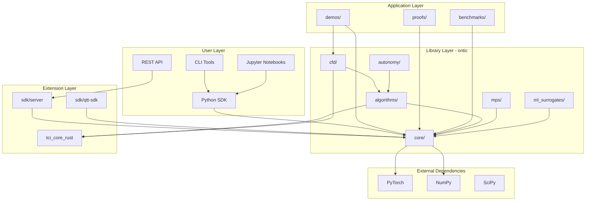
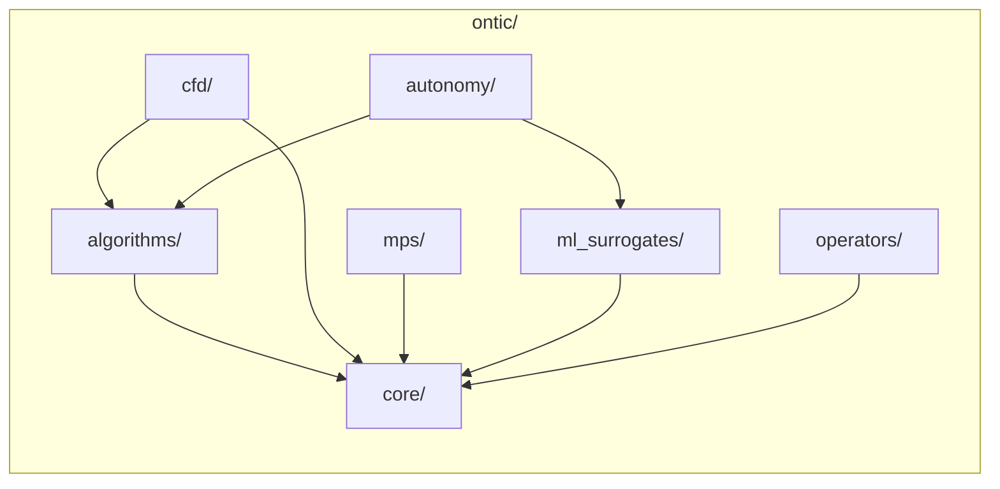
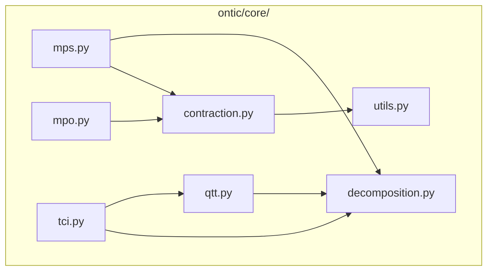
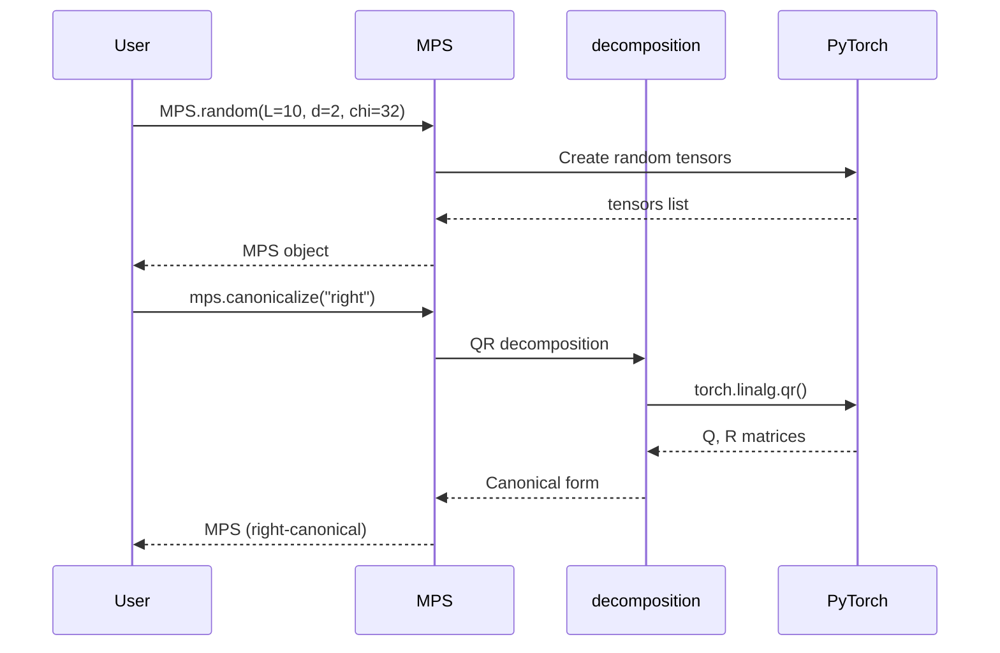
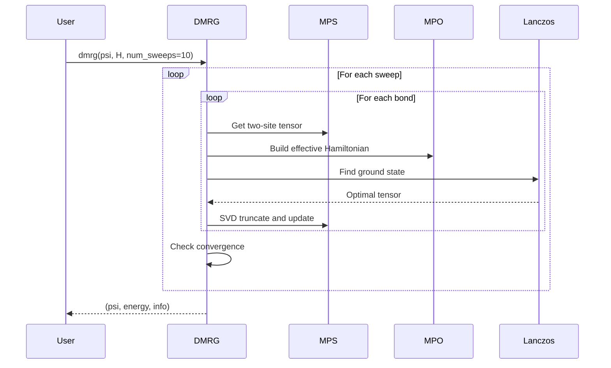
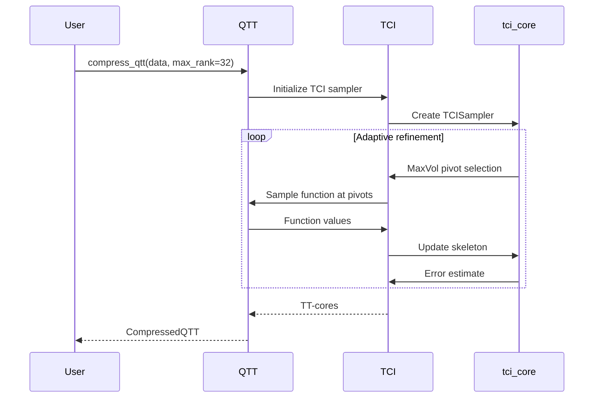
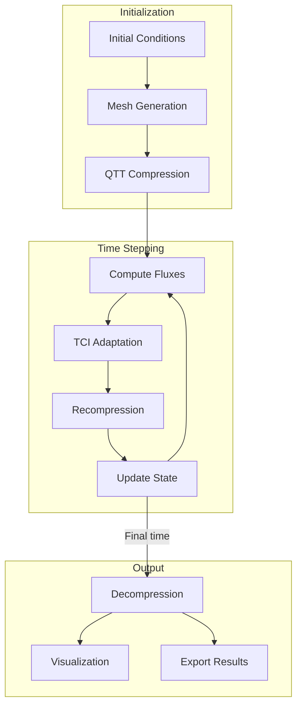
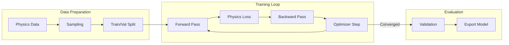

# The Physics OS — Architecture Guide

This document provides detailed architecture documentation for The Physics OS, including dependency diagrams and data flow for key operations.

---

## Table of Contents

1. [High-Level Architecture](#high-level-architecture)
2. [Module Dependencies](#module-dependencies)
3. [Core Data Flow](#core-data-flow)
4. [Algorithm Workflows](#algorithm-workflows)
5. [Extension Points](#extension-points)

---

## High-Level Architecture



---

## Module Dependencies

### ontic/ Internal Dependencies



### Core Submodule Structure



### External Dependency Map

| Module | PyTorch | NumPy | SciPy | Rust |
|--------|---------|-------|-------|------|
| ontic/core/ | ✅ | ✅ | ✅ | ⚪ |
| ontic/algorithms/ | ✅ | ✅ | ✅ | ✅ |
| ontic/cfd/ | ✅ | ✅ | ✅ | ✅ |
| ontic/mps/ | ✅ | ✅ | ⚪ | ⚪ |
| ontic/ml_surrogates/ | ✅ | ✅ | ⚪ | ⚪ |
| sdk/server/ | ⚪ | ✅ | ⚪ | ⚪ |

Legend: ✅ Required | ⚪ Optional

---

## Core Data Flow

### MPS Creation and Manipulation



### DMRG Algorithm Flow



### QTT Compression Flow



---

## Algorithm Workflows

### CFD Solver Pipeline



### ML Surrogate Training



---

## Extension Points

### Adding New Hamiltonians

```python
# In ontic/mps/hamiltonians.py
from ontic.core import MPO

def my_hamiltonian_mpo(L: int, **params) -> MPO:
    """Create MPO for my Hamiltonian."""
    # 1. Define local operators
    # 2. Build MPO tensors
    # 3. Return MPO
    ...
```

### Adding New CFD Flux Schemes

```python
# In ontic/cfd/fluxes.py
from ontic.cfd.base import FluxScheme

class MyFlux(FluxScheme):
    """Custom flux scheme."""
    
    def compute(self, UL, UR, gamma):
        # Implement flux computation
        ...
```

### Adding Rust Extensions

```rust
// In crates/tci_core_rust/src/lib.rs
#[pyclass]
pub struct MyExtension {
    // ...
}

#[pymethods]
impl MyExtension {
    #[new]
    fn new() -> Self {
        // ...
    }
}
```

---

## See Also

- [ONBOARDING.md](ONBOARDING.md) - Getting started guide
- [CONTRIBUTING.md](../CONTRIBUTING.md) - Contribution guidelines
- [README.md](../README.md) - Project overview
